# Complete DBMS Guide: One Single Source from Basic to Advanced

This guide is a complete, self-contained learning resource for Database Management Systems. It starts from absolute basics and moves toward advanced design, SQL, transactions, recovery, storage, indexing, optimization, distributed systems, NoSQL, warehousing, security, administration, performance, and interview preparation.

The examples use PostgreSQL-compatible SQL unless a concept is explicitly standard SQL or DBMS-independent.

## Table of Contents

- [1. Foundations of DBMS](#1-foundations-of-dbms)
  - [1.1 Data, Information, and Metadata](#11-data-information-and-metadata)
  - [1.2 Database, DBMS, RDBMS, and Database System](#12-database-dbms-rdbms-and-database-system)
  - [1.3 File System vs DBMS](#13-file-system-vs-dbms)
  - [1.4 Advantages and Disadvantages of DBMS](#14-advantages-and-disadvantages-of-dbms)
  - [1.5 DBMS Applications, Users, and DBA Role](#15-dbms-applications-users-and-dba-role)
  - [1.6 Database Languages](#16-database-languages)
- [2. Database Architecture](#2-database-architecture)
  - [2.1 1-Tier, 2-Tier, and 3-Tier Architecture](#21-1-tier-2-tier-and-3-tier-architecture)
  - [2.2 ANSI/SPARC Architecture](#22-ansisparc-architecture)
  - [2.3 Data Abstraction and Data Independence](#23-data-abstraction-and-data-independence)
  - [2.4 Schema, Instance, Catalog, and Client-Server Architecture](#24-schema-instance-catalog-and-client-server-architecture)
- [3. Data Models](#3-data-models)
  - [3.1 Classical Data Models](#31-classical-data-models)
  - [3.2 Modern Data Models](#32-modern-data-models)
  - [3.3 Comparison of Data Models](#33-comparison-of-data-models)
- [4. ER Model and Database Design](#4-er-model-and-database-design)
  - [4.1 Entities, Attributes, and Entity Sets](#41-entities-attributes-and-entity-sets)
  - [4.2 Relationships, Cardinality, and Participation](#42-relationships-cardinality-and-participation)
  - [4.3 Weak Entities, Strong Entities, and Identifying Relationships](#43-weak-entities-strong-entities-and-identifying-relationships)
  - [4.4 Extended ER Model](#44-extended-er-model)
  - [4.5 ER Diagram Notation and Mermaid Diagrams](#45-er-diagram-notation-and-mermaid-diagrams)
  - [4.6 ER-to-Relational Mapping](#46-er-to-relational-mapping)
- [5. Relational Model](#5-relational-model)
  - [5.1 Core Terms](#51-core-terms)
  - [5.2 Keys](#52-keys)
  - [5.3 Integrity and Relational Constraints](#53-integrity-and-relational-constraints)
  - [5.4 Relational Design Principles](#54-relational-design-principles)
- [6. Relational Algebra and Relational Calculus](#6-relational-algebra-and-relational-calculus)
  - [6.1 Base Relations Used in Examples](#61-base-relations-used-in-examples)
  - [6.2 Relational Algebra Operations](#62-relational-algebra-operations)
  - [6.3 Joins and Division](#63-joins-and-division)
  - [6.4 Tuple and Domain Relational Calculus](#64-tuple-and-domain-relational-calculus)
- [7. SQL Complete Guide](#7-sql-complete-guide)
  - [7.1 SQL Overview and Command Families](#71-sql-overview-and-command-families)
  - [7.2 DDL: Databases, Tables, Constraints, ALTER, DROP, TRUNCATE](#72-ddl-databases-tables-constraints-alter-drop-truncate)
  - [7.3 DML and DQL: INSERT, UPDATE, DELETE, SELECT](#73-dml-and-dql-insert-update-delete-select)
  - [7.4 Filtering, Sorting, Grouping, and Functions](#74-filtering-sorting-grouping-and-functions)
  - [7.5 Joins, Subqueries, and Set Logic](#75-joins-subqueries-and-set-logic)
  - [7.6 Views, Materialized Views, Indexes, and Sequences](#76-views-materialized-views-indexes-and-sequences)
  - [7.7 Procedures, Functions, Triggers, Cursors, and Dynamic SQL](#77-procedures-functions-triggers-cursors-and-dynamic-sql)
  - [7.8 Window Functions, CTEs, Recursive CTEs, and Transactions](#78-window-functions-ctes-recursive-ctes-and-transactions)
  - [7.9 Error Handling, SQL Injection Prevention, and Best Practices](#79-error-handling-sql-injection-prevention-and-best-practices)
- [8. Functional Dependencies and Normalization](#8-functional-dependencies-and-normalization)
  - [8.1 Redundancy and Anomalies](#81-redundancy-and-anomalies)
  - [8.2 Functional Dependencies](#82-functional-dependencies)
  - [8.3 Closure, Armstrong Axioms, and Covers](#83-closure-armstrong-axioms-and-covers)
  - [8.4 Decomposition, Losslessness, and Dependency Preservation](#84-decomposition-losslessness-and-dependency-preservation)
  - [8.5 Normal Forms](#85-normal-forms)
  - [8.6 Complete Normalization Example](#86-complete-normalization-example)
  - [8.7 Normalization Practice with Solutions](#87-normalization-practice-with-solutions)
- [9. Transactions and Concurrency Control](#9-transactions-and-concurrency-control)
  - [9.1 Transactions, ACID, and States](#91-transactions-acid-and-states)
  - [9.2 Schedules and Serializability](#92-schedules-and-serializability)
  - [9.3 Recoverability Classes](#93-recoverability-classes)
  - [9.4 Concurrency Problems](#94-concurrency-problems)
  - [9.5 Locking and Two-Phase Locking](#95-locking-and-two-phase-locking)
  - [9.6 Deadlocks and Timestamp-Based Protocols](#96-deadlocks-and-timestamp-based-protocols)
  - [9.7 Optimistic, MVCC, Snapshot Isolation, and SQL Isolation Levels](#97-optimistic-mvcc-snapshot-isolation-and-sql-isolation-levels)
- [10. Database Recovery](#10-database-recovery)
- [11. Storage and File Organization](#11-storage-and-file-organization)
- [12. Indexing and Hashing](#12-indexing-and-hashing)
- [13. Query Processing and Optimization](#13-query-processing-and-optimization)
- [14. Distributed Databases](#14-distributed-databases)
- [15. NoSQL and Modern Databases](#15-nosql-and-modern-databases)
- [16. Data Warehousing and Analytics](#16-data-warehousing-and-analytics)
- [17. Database Security](#17-database-security)
- [18. Database Administration](#18-database-administration)
- [19. Performance Tuning and Best Practices](#19-performance-tuning-and-best-practices)
- [20. Complete Sample Database Project](#20-complete-sample-database-project)
- [21. Comparison Tables](#21-comparison-tables)
- [22. Practice and Interview Preparation](#22-practice-and-interview-preparation)
- [23. Final Revision Section](#23-final-revision-section)

## 1. Foundations of DBMS

### 1.1 Data, Information, and Metadata

**Data** is raw fact. It may be a number, name, date, image, status, measurement, or event.

Examples:

- `101`
- `Asha Rao`
- `2026-06-20`
- `payment_success`
- `89.5`

**Information** is processed data that has meaning in a context.

Example:

| Raw data | Context | Information |
|---|---|---|
| `89.5` | Marks in DBMS exam | The student scored 89.5 marks |
| `payment_success` | Order transaction status | The order has been paid |
| `2026-06-20` | Due date | The assignment is due on June 20, 2026 |

**Metadata** is data about data. It describes structure, rules, meaning, ownership, and storage.

Examples:

| Metadata item | Meaning |
|---|---|
| Column name `customer_email` | Explains what values represent |
| Data type `VARCHAR(255)` | Email is stored as variable-length text |
| Constraint `UNIQUE` | Duplicate email values are not allowed |
| Index on `orders(customer_id)` | Speeds up order lookup by customer |
| Table owner | User or role allowed to manage the table |

In a DBMS, metadata is stored in a **catalog** or **data dictionary**. This catalog lets the DBMS understand tables, columns, constraints, indexes, users, privileges, and statistics.

### 1.2 Database, DBMS, RDBMS, and Database System

**Database**: An organized collection of related data stored so it can be accessed, managed, and updated.

Example: An e-commerce database stores customers, products, orders, payments, shipments, and reviews.

**DBMS**: A Database Management System is software used to define, create, store, query, update, secure, recover, and administer databases.

Examples: PostgreSQL, MySQL, Oracle Database, SQL Server, SQLite, MongoDB, Cassandra, Neo4j.

**RDBMS**: A Relational Database Management System stores data as relations, commonly represented as tables. It uses rows, columns, keys, constraints, and SQL.

Examples: PostgreSQL, MySQL, Oracle Database, SQL Server, MariaDB, SQLite.

**Database system**: The complete environment that includes:

- Database
- DBMS software
- Application programs
- Users
- Hardware and storage
- Network
- Policies, procedures, and administrators

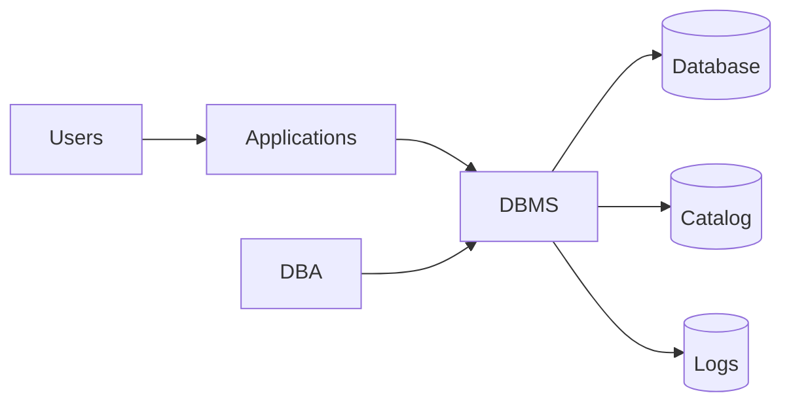

### 1.3 File System vs DBMS

Before DBMSs, many applications stored data in ordinary files. File systems are still useful, but they do not provide the same data management guarantees as a DBMS.

| Feature | File system | DBMS |
|---|---|---|
| Data structure | Application-specific files | Defined schemas, tables, documents, graphs, or other models |
| Data redundancy | Often high | Controlled through design and constraints |
| Data inconsistency | Common when duplicate files diverge | Reduced through central control |
| Querying | Custom program logic | Declarative query languages such as SQL |
| Concurrency | Hard to implement correctly | Built-in transaction and locking/MVCC |
| Security | Mostly file permissions | Fine-grained users, roles, privileges, row policies |
| Backup/recovery | Manual or file-level | Transaction logs, checkpoints, point-in-time recovery |
| Integrity | Enforced by application code | Enforced by constraints and transactions |
| Data independence | Low | Logical and physical independence |

Example file-system problem:

- `students.txt` contains `student_id, name, department_name`
- `fees.txt` also contains `student_id, name, department_name`
- A student changes department.
- If one file is updated and another is not, the system becomes inconsistent.

DBMS solution:

- Store student once in `students`.
- Store departments in `departments`.
- Store references using foreign keys.
- Update one authoritative row.

### 1.4 Advantages and Disadvantages of DBMS

Advantages:

- **Reduced redundancy**: Normalization and central storage avoid unnecessary duplication.
- **Improved consistency**: Constraints and transactions prevent many invalid states.
- **Data sharing**: Multiple users and applications can use the same database.
- **Security**: Authentication, authorization, roles, views, and auditing control access.
- **Integrity enforcement**: Primary keys, foreign keys, `CHECK`, `NOT NULL`, and `UNIQUE` rules protect correctness.
- **Concurrency control**: Transactions allow many users to work at the same time.
- **Backup and recovery**: Logs and backups restore data after failures.
- **Data independence**: Applications can survive many physical or logical changes.
- **Standard querying**: SQL lets users ask complex questions without writing low-level file code.
- **Administration and monitoring**: DBMSs expose tools for tuning, statistics, storage, and health.

Disadvantages:

- **Cost**: Enterprise licenses, hardware, storage, and skilled staff can be expensive.
- **Complexity**: Setup, tuning, security, recovery, and modeling require expertise.
- **Performance overhead**: Transactions, logging, parsing, and constraints add overhead compared with simple file writes.
- **Single point of failure if poorly designed**: Centralization without replication or backup is risky.
- **Migration effort**: Changing schema or DBMS platform can be difficult.
- **Operational burden**: Backups, upgrades, monitoring, and access control must be maintained.

### 1.5 DBMS Applications, Users, and DBA Role

Common DBMS applications:

- Banking and financial systems
- Airline and railway reservation systems
- E-commerce platforms
- Education systems
- Hospital and health record systems
- Telecom billing and call records
- Inventory and supply chain systems
- Social networks
- Government identity and tax systems
- Analytics, reporting, and data warehousing

DBMS users:

| User type | Description | Example |
|---|---|---|
| Naive/end user | Uses predefined screens | Customer placing an order |
| Application programmer | Writes application code using the DB | Backend engineer |
| Sophisticated user | Writes complex queries or analyses | Data analyst |
| Specialized user | Builds unusual DB applications | CAD, GIS, scientific systems |
| DBA | Administers database systems | Database administrator |

DBA responsibilities:

- Install and configure DBMS software.
- Design or review schemas.
- Create users, roles, and privileges.
- Define backup and recovery strategy.
- Monitor performance, locks, replication, and storage.
- Tune queries and indexes.
- Plan capacity.
- Manage migrations and schema versions.
- Ensure high availability and disaster recovery.
- Maintain security and compliance.

### 1.6 Database Languages

SQL commands are often grouped by purpose.

| Language family | Full form | Purpose | Examples |
|---|---|---|---|
| DDL | Data Definition Language | Define or change database structure | `CREATE`, `ALTER`, `DROP`, `TRUNCATE` |
| DML | Data Manipulation Language | Insert, modify, delete data | `INSERT`, `UPDATE`, `DELETE` |
| DQL | Data Query Language | Retrieve data | `SELECT` |
| DCL | Data Control Language | Control access | `GRANT`, `REVOKE` |
| TCL | Transaction Control Language | Manage transactions | `COMMIT`, `ROLLBACK`, `SAVEPOINT` |

Example:

```sql
CREATE TABLE students (
    student_id BIGINT PRIMARY KEY,
    full_name TEXT NOT NULL,
    email TEXT UNIQUE NOT NULL,
    created_at TIMESTAMPTZ NOT NULL DEFAULT now()
);

INSERT INTO students (student_id, full_name, email)
VALUES (1, 'Asha Rao', 'asha@example.com');

SELECT student_id, full_name
FROM students
WHERE email = 'asha@example.com';

COMMIT;
```

## 2. Database Architecture

### 2.1 1-Tier, 2-Tier, and 3-Tier Architecture

**1-tier architecture** places user interface, business logic, and DBMS on the same machine. It is common in local desktop or embedded systems.

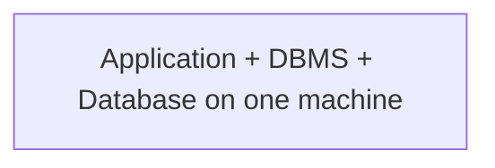

Use cases:

- SQLite in a mobile app
- Local learning environment
- Small desktop application

Limitations:

- Hard to share across many users.
- Weak separation of concerns.
- Scaling is limited.

**2-tier architecture** separates the client from the database server. The client contains presentation and often business logic. It directly talks to the DBMS.

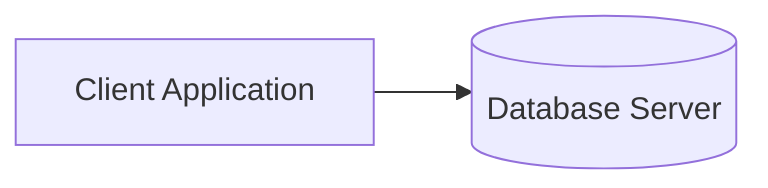

Use cases:

- Internal desktop app connected to PostgreSQL or SQL Server
- Small office inventory system

Limitations:

- Many clients need database credentials.
- Business rules may be duplicated in clients.
- Database is exposed more directly to client machines.

**3-tier architecture** separates presentation, application/business logic, and database.

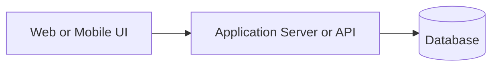

Advantages:

- Better security: clients do not connect directly to DB.
- Better scalability: app servers can be scaled independently.
- Centralized business rules.
- Easier maintenance and deployment.

Most modern web applications use 3-tier or multi-tier architecture.

### 2.2 ANSI/SPARC Architecture

The ANSI/SPARC architecture describes three database levels:

| Level | Also called | What it describes |
|---|---|---|
| Physical level | Internal level | How data is physically stored |
| Logical level | Conceptual level | What data is stored and how entities relate |
| View level | External level | User-specific views of data |

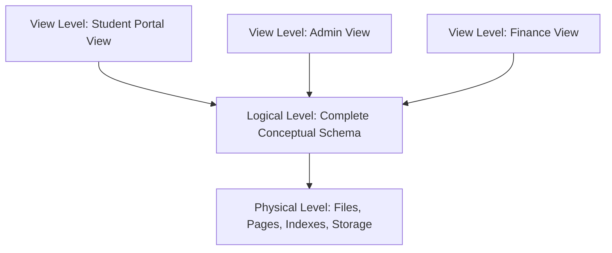

**Physical level**:

- Data files
- Page layout
- Index structures
- Compression
- Partition placement
- Disk or SSD blocks

**Logical level**:

- Tables
- Columns
- Relationships
- Constraints
- Entity types
- Data types

**View level**:

- Subsets of columns
- Derived data
- Security-limited views
- User-specific representation

Example:

- Physical: `customers` table stored in multiple 8 KB pages with B+ tree indexes.
- Logical: `customers(customer_id, name, email, status)`.
- View: support staff sees `customer_id, name, status` but not sensitive fields.

### 2.3 Data Abstraction and Data Independence

**Data abstraction** hides storage complexity from users. A user writes:

```sql
SELECT full_name
FROM customers
WHERE customer_id = 10;
```

The user does not need to know:

- Which disk block stores the row.
- Which index is used.
- Whether data is cached in memory.
- Whether a table is partitioned.

**Data independence** is the ability to change schema at one level without requiring changes at the next higher level.

| Type | Meaning | Example |
|---|---|---|
| Physical data independence | Change physical storage without changing logical schema | Add index, move files, partition table |
| Logical data independence | Change logical schema without changing all views/apps | Add column, split table while preserving a view |

Physical data independence is easier to achieve than logical data independence because applications often depend on table and column names.

### 2.4 Schema, Instance, Catalog, and Client-Server Architecture

**Schema** is the database design or structure. It changes relatively rarely.

Example:

```sql
CREATE TABLE courses (
    course_id BIGINT PRIMARY KEY,
    title TEXT NOT NULL,
    credits INTEGER NOT NULL CHECK (credits > 0)
);
```

**Instance** is the actual data stored at a particular moment.

Example:

| course_id | title | credits |
|---:|---|---:|
| 1 | Database Systems | 4 |
| 2 | Operating Systems | 4 |

If a new course is inserted, the instance changes. The schema stays the same.

**Database catalog** stores metadata such as:

- Schemas, tables, columns
- Data types
- Constraints
- Indexes
- Views
- Users, roles, privileges
- Statistics used by optimizer

In PostgreSQL, catalog-like information can be queried through `information_schema` and `pg_catalog`.

```sql
SELECT table_schema, table_name
FROM information_schema.tables
WHERE table_type = 'BASE TABLE';
```

**Centralized architecture** keeps the DBMS and database in one central location. Clients access it through applications or network connections. It is simpler but may need high availability protection.

**Client-server architecture** separates client requests from server data management. The DB server handles queries, transactions, storage, concurrency, security, and recovery.

## 3. Data Models

A **data model** defines how data is represented, related, constrained, and manipulated.

### 3.1 Classical Data Models

**Hierarchical model**:

- Organizes data as a tree.
- Each child has one parent.
- Good for strict one-to-many structures.
- Navigation is path-based.

Example:

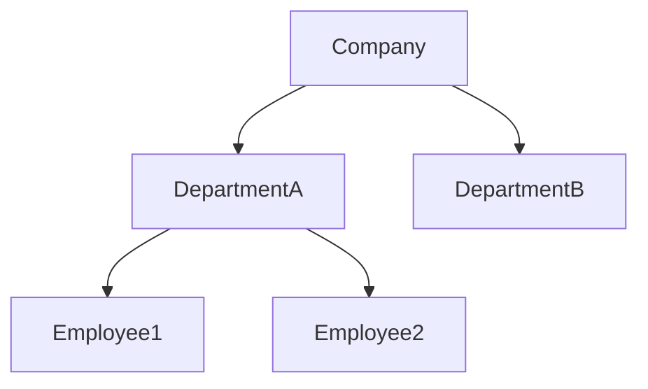

Strengths:

- Simple parent-child access.
- Efficient for predictable hierarchy.

Weaknesses:

- Many-to-many relationships are difficult.
- Structural changes are rigid.

**Network model**:

- Organizes data as records connected by links.
- A child can have multiple parents.
- Supports many-to-many relationships better than hierarchical.

Strengths:

- Flexible compared with hierarchical.
- Efficient navigational access.

Weaknesses:

- Complex to design and query.
- Application depends heavily on access paths.

**Relational model**:

- Represents data as relations, usually tables.
- Uses rows, columns, keys, and constraints.
- Uses relational algebra as theoretical foundation.
- SQL is the dominant practical language.

Example:

| customer_id | name | email |
|---:|---|---|
| 1 | Asha | asha@example.com |
| 2 | Neel | neel@example.com |

Strengths:

- Strong theory.
- Declarative querying.
- Data independence.
- Integrity constraints.
- Mature transaction support.

Weaknesses:

- Object-graph impedance mismatch in some applications.
- Horizontal scaling requires careful design.
- Very flexible or nested data may require JSON or separate tables.

### 3.2 Modern Data Models

**Object-oriented model**:

- Stores objects with identity, attributes, and methods.
- Matches object-oriented programming concepts.
- Useful for complex objects such as CAD, multimedia, or engineering data.

**Object-relational model**:

- Extends relational databases with object-like features.
- Supports user-defined types, arrays, JSON, inheritance-like features, and complex values.
- PostgreSQL is often considered object-relational.

**Semi-structured model**:

- Data has irregular, flexible structure.
- XML and JSON are common formats.
- Useful when records do not all share the same attributes.

**Document model**:

- Stores documents, usually JSON-like.
- A document aggregates related data together.

Example document:

```json
{
  "order_id": 101,
  "customer": {"id": 1, "name": "Asha"},
  "items": [
    {"sku": "P100", "qty": 2},
    {"sku": "P200", "qty": 1}
  ]
}
```

Good for:

- Content management
- Product catalogs with varied attributes
- Event payloads
- Rapidly evolving application data

**Graph model**:

- Represents entities as nodes and relationships as edges.
- Relationships are first-class objects.

Good for:

- Social networks
- Fraud detection
- Recommendation systems
- Knowledge graphs
- Network topology

**Key-value model**:

- Stores values by unique keys.
- Very fast for simple lookup.

Example:

| Key | Value |
|---|---|
| `session:abc123` | serialized session data |
| `cart:user:42` | shopping cart JSON |

Good for:

- Caching
- Sessions
- Preferences
- Counters

**Column-family model**:

- Stores rows with flexible columns grouped into column families.
- Optimized for large-scale distributed writes and sparse data.

Good for:

- Time-series-like event storage
- Wide sparse datasets
- High-write distributed workloads

### 3.3 Comparison of Data Models

| Model | Structure | Relationship handling | Query style | Best use |
|---|---|---|---|---|
| Hierarchical | Tree | Parent-child | Navigational | Strict hierarchies |
| Network | Graph-like records | Many-to-many links | Navigational | Legacy complex record systems |
| Relational | Tables | Foreign keys and joins | Declarative SQL | General-purpose structured data |
| Object-oriented | Objects | Object references | OOP-style | Complex object persistence |
| Object-relational | Tables plus complex types | SQL plus extensions | SQL | Relational apps needing richer types |
| Semi-structured | XML/JSON | Nested data | Path/query language | Flexible data exchange |
| Document | JSON-like documents | Embedded or referenced | Document queries | Aggregate-oriented apps |
| Graph | Nodes and edges | First-class edges | Graph traversal | Relationship-heavy data |
| Key-value | Key to opaque value | Application-managed | Key lookup | Cache/session/simple lookup |
| Column-family | Wide sparse rows | Denormalized | Key/range queries | Distributed high-write workloads |

## 4. ER Model and Database Design

The Entity-Relationship model helps design a database conceptually before creating tables.

### 4.1 Entities, Attributes, and Entity Sets

**Entity**: A distinguishable real-world object or concept.

Examples:

- Customer
- Product
- Order
- Employee
- Course

**Entity set**: A collection of similar entities.

Example: All customers form the `Customer` entity set.

**Attribute**: A property of an entity or relationship.

For `Customer`, attributes may include:

- `customer_id`
- `full_name`
- `email`
- `phone`
- `created_at`

Types of attributes:

| Attribute type | Definition | Example |
|---|---|---|
| Simple | Cannot be divided meaningfully | Age, salary |
| Composite | Can be divided into components | Address: street, city, state |
| Derived | Computed from other attributes | Age from date of birth |
| Stored | Physically stored | Date of birth |
| Multivalued | Can have multiple values | Phone numbers |
| Key attribute | Uniquely identifies entity | Student ID |

Design guidance:

- Store stable facts, derive unstable computed facts when possible.
- Break composite attributes into parts if queries need those parts.
- Model multivalued attributes as separate tables in relational design.
- Choose keys that are unique, stable, minimal, and never reused.

### 4.2 Relationships, Cardinality, and Participation

**Relationship**: An association among entities.

Examples:

- Customer places Order.
- Student enrolls in Course.
- Employee manages Department.

**Relationship set**: A collection of similar relationships.

**Degree of relationship**: Number of entity sets involved.

| Degree | Name | Example |
|---:|---|---|
| 1 | Unary/recursive | Employee manages Employee |
| 2 | Binary | Customer places Order |
| 3 | Ternary | Supplier supplies Part to Project |

**Cardinality** describes how many entities can participate.

| Cardinality | Meaning | Example |
|---|---|---|
| One-to-one | One A relates to at most one B | Person and passport |
| One-to-many | One A relates to many B | Customer and orders |
| Many-to-one | Many A relate to one B | Orders and customer |
| Many-to-many | Many A relate to many B | Students and courses |

**Participation constraint** describes whether participation is mandatory.

| Participation | Meaning | Example |
|---|---|---|
| Total participation | Every entity must participate | Every order must belong to a customer |
| Partial participation | Some entities may not participate | Some customers may have no orders |

Example:

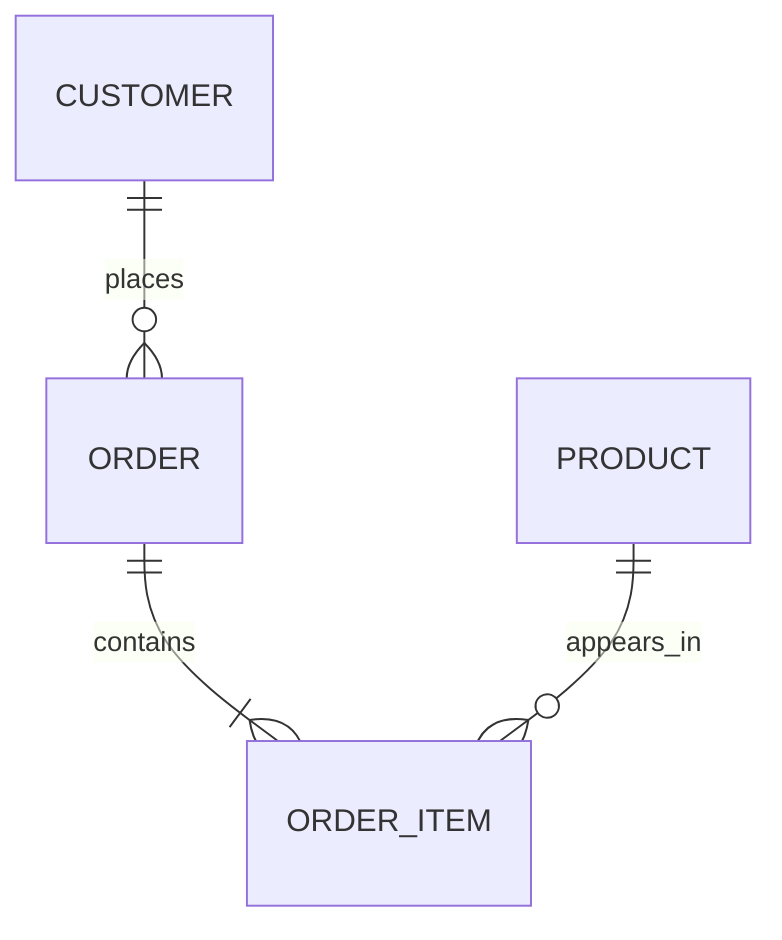

Interpretation:

- One customer can place zero or many orders.
- Each order belongs to exactly one customer.
- Each order contains one or many order items.
- A product can appear in many order items.

### 4.3 Weak Entities, Strong Entities, and Identifying Relationships

**Strong entity**: Has its own primary key.

Example: `Customer(customer_id)`.

**Weak entity**: Cannot be uniquely identified by its own attributes alone. It depends on an owner entity.

Example: `OrderItem` may be identified by `(order_id, line_no)`. `line_no` alone is not globally unique.

**Partial key**: Attribute that uniquely identifies a weak entity among entities with the same owner.

Example: `line_no` identifies an item within one order.

**Identifying relationship**: Relationship between a weak entity and its owner.

Relational mapping:

```sql
CREATE TABLE orders (
    order_id BIGINT PRIMARY KEY
);

CREATE TABLE order_items (
    order_id BIGINT NOT NULL REFERENCES orders(order_id),
    line_no INTEGER NOT NULL,
    product_name TEXT NOT NULL,
    quantity INTEGER NOT NULL CHECK (quantity > 0),
    PRIMARY KEY (order_id, line_no)
);
```

### 4.4 Extended ER Model

The Extended ER model adds concepts useful for richer design.

**Generalization**: Bottom-up process of extracting common features from multiple entity types into a higher-level entity.

Example:

- `Car` and `Truck` become `Vehicle`.

**Specialization**: Top-down process of dividing an entity type into subtypes.

Example:

- `Employee` becomes `FullTimeEmployee` and `ContractEmployee`.

**ISA relationship**: Means "is a". A full-time employee is an employee.

**Constraints in specialization**:

| Constraint | Meaning |
|---|---|
| Disjoint | One supertype entity can belong to only one subtype |
| Overlapping | One supertype entity can belong to multiple subtypes |
| Total | Every supertype entity must be in some subtype |
| Partial | Some supertype entities may be in no subtype |

**Aggregation**: Treats a relationship as a higher-level entity so it can participate in another relationship.

Example:

- `Employee works_on Project`.
- `Manager monitors (Employee works_on Project)`.

Aggregation is useful when a relationship itself needs attributes or relationships.

### 4.5 ER Diagram Notation and Mermaid Diagrams

Common ER notation:

| Concept | Chen notation | Crow's foot/Mermaid idea |
|---|---|---|
| Entity | Rectangle | Entity box |
| Weak entity | Double rectangle | Entity with identifying relationship and composite key |
| Attribute | Oval | Listed inside entity |
| Key attribute | Underlined oval | PK marker |
| Relationship | Diamond | Labeled connector |
| Identifying relationship | Double diamond | Owner relationship with composite PK |
| Multivalued attribute | Double oval | Separate table |
| Derived attribute | Dashed oval | Computed column or query |
| Total participation | Double line | Mandatory side |
| Partial participation | Single line | Optional side |

Mermaid ER example:

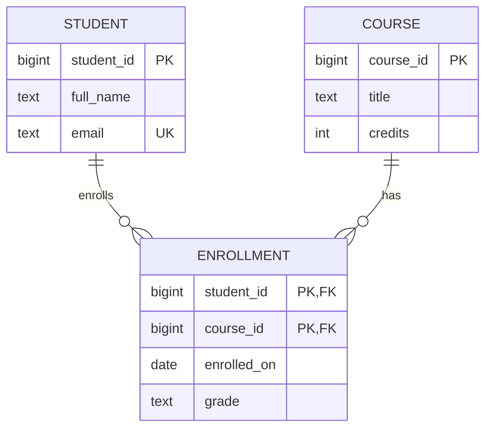

### 4.6 ER-to-Relational Mapping

Rules:

1. **Strong entity** becomes a table. Simple attributes become columns. Primary key remains primary key.
2. **Composite attribute** is usually represented by its simple components.
3. **Multivalued attribute** becomes a separate table with the owner key plus the attribute.
4. **Weak entity** becomes a table containing owner primary key as foreign key. Primary key is owner key plus partial key.
5. **One-to-one relationship** can be mapped by placing a foreign key on one side, preferably the total participation side.
6. **One-to-many relationship** is mapped by placing a foreign key on the many side.
7. **Many-to-many relationship** becomes a junction table containing foreign keys to both entities.
8. **Relationship attributes** are placed in the relationship table for many-to-many, or on the appropriate foreign-key side for one-to-many.
9. **Ternary relationship** becomes a table with foreign keys to all participating entity tables.
10. **Specialization/generalization** can be mapped using one table per hierarchy, one table per subtype, or one table per concrete class.

Example many-to-many:

```sql
CREATE TABLE students (
    student_id BIGINT PRIMARY KEY,
    full_name TEXT NOT NULL
);

CREATE TABLE courses (
    course_id BIGINT PRIMARY KEY,
    title TEXT NOT NULL
);

CREATE TABLE enrollments (
    student_id BIGINT NOT NULL REFERENCES students(student_id),
    course_id BIGINT NOT NULL REFERENCES courses(course_id),
    enrolled_on DATE NOT NULL DEFAULT CURRENT_DATE,
    grade TEXT,
    PRIMARY KEY (student_id, course_id)
);
```

## 5. Relational Model

### 5.1 Core Terms

**Relation**: A table-like structure with rows and columns.

**Tuple**: A row in a relation.

**Attribute**: A column in a relation.

**Domain**: Set of allowed values for an attribute.

**Degree**: Number of attributes in a relation.

**Cardinality**: Number of tuples in a relation.

**Relational schema**: Structure of a relation.

Example: `Student(student_id, full_name, email, department_id)`.

**Relational instance**: Actual data in the relation at a particular time.

Example:

| student_id | full_name | email | department_id |
|---:|---|---|---:|
| 1 | Asha Rao | asha@example.com | 10 |
| 2 | Neel Shah | neel@example.com | 20 |

Properties of relations:

- Each relation has a unique name.
- Each attribute has a unique name within a relation.
- Each cell should contain atomic values in 1NF.
- Order of rows is not logically important.
- Order of columns is not logically important.
- Duplicate tuples are not allowed in pure relational theory, though SQL tables may allow duplicates unless constrained.

### 5.2 Keys

**Super key**: Any set of attributes that uniquely identifies tuples.

Example: In `Student(student_id, email, phone, name)`, `{student_id}`, `{email}`, and `{student_id, email}` may all be super keys.

**Candidate key**: Minimal super key. No attribute can be removed while preserving uniqueness.

Example: `{student_id}` and `{email}` may be candidate keys.

**Primary key**: Candidate key chosen as the main identifier.

**Alternate key**: Candidate key not chosen as primary key.

**Foreign key**: Attribute or attributes that reference a key in another table.

**Composite key**: Key made of multiple attributes.

Example: `(student_id, course_id)` in `enrollments`.

**Surrogate key**: Artificial identifier, such as generated numeric ID or UUID.

**Natural key**: Real-world attribute used as a key, such as email, ISBN, or national ID.

Key selection guidelines:

- Prefer stable keys.
- Avoid keys that can change frequently.
- Avoid sensitive identifiers as primary keys when possible.
- Use surrogate keys when natural keys are long, unstable, composite, or sensitive.
- Still enforce natural uniqueness with `UNIQUE` constraints when needed.

Example:

```sql
CREATE TABLE customers (
    customer_id BIGINT GENERATED ALWAYS AS IDENTITY PRIMARY KEY,
    email TEXT NOT NULL UNIQUE,
    full_name TEXT NOT NULL
);
```

Here `customer_id` is a surrogate primary key and `email` is an alternate key.

### 5.3 Integrity and Relational Constraints

**Domain integrity** ensures values belong to valid domains.

Examples:

```sql
age INTEGER CHECK (age >= 0)
status TEXT CHECK (status IN ('active', 'inactive'))
email TEXT NOT NULL
```

**Entity integrity** ensures primary key values are unique and not null.

```sql
student_id BIGINT PRIMARY KEY
```

**Referential integrity** ensures foreign keys match existing referenced rows or are null when allowed.

```sql
department_id BIGINT REFERENCES departments(department_id)
```

**Relational constraints** include:

- Domain constraints
- Key constraints
- Entity integrity constraints
- Referential integrity constraints
- `CHECK` constraints
- Business rules implemented through triggers or application logic

Example:

```sql
CREATE TABLE accounts (
    account_id BIGINT GENERATED ALWAYS AS IDENTITY PRIMARY KEY,
    customer_id BIGINT NOT NULL REFERENCES customers(customer_id),
    balance NUMERIC(12, 2) NOT NULL DEFAULT 0 CHECK (balance >= 0),
    currency CHAR(3) NOT NULL DEFAULT 'USD'
);
```

### 5.4 Relational Design Principles

Good relational design aims for:

- Clear entities and relationships.
- Minimal redundancy.
- Correct keys.
- Proper normalization.
- Meaningful constraints.
- Consistent naming.
- Atomic values unless the DBMS supports and the use case justifies structured values.
- Avoiding update, insert, and delete anomalies.
- Queries that can be indexed and optimized.
- Schema that expresses business truth, not only application convenience.

Common mistakes:

- Storing comma-separated lists in one column.
- Using text values instead of foreign keys for repeated entities.
- Missing `NOT NULL` constraints for required data.
- Missing `UNIQUE` constraints for natural uniqueness.
- Using vague column names such as `value1` or `data`.
- Creating foreign keys without indexes for frequent joins.
- Over-normalizing small read-heavy lookup data without benefit.

## 6. Relational Algebra and Relational Calculus

Relational algebra is procedural: it describes how to obtain a result using operations. Relational calculus is declarative: it describes what result is desired using logic.

### 6.1 Base Relations Used in Examples

Assume these relations:

`Student(student_id, name, dept_id)`

| student_id | name | dept_id |
|---:|---|---:|
| 1 | Asha | 10 |
| 2 | Neel | 10 |
| 3 | Mira | 20 |

`Course(course_id, title, dept_id)`

| course_id | title | dept_id |
|---:|---|---:|
| 101 | DBMS | 10 |
| 102 | OS | 10 |
| 201 | AI | 20 |

`Enrollment(student_id, course_id, grade)`

| student_id | course_id | grade |
|---:|---:|---|
| 1 | 101 | A |
| 1 | 102 | B |
| 2 | 101 | A |
| 3 | 201 | A |

### 6.2 Relational Algebra Operations

Notation in this guide uses ASCII names for portability:

- Selection: `sigma condition (R)`
- Projection: `pi attributes (R)`
- Rename: `rho new_name (R)`
- Union: `R union S`
- Set difference: `R - S`
- Intersection: `R intersect S`
- Cartesian product: `R x S`

**Selection** filters rows.

Relational algebra:

```text
sigma dept_id = 10 (Student)
```

SQL:

```sql
SELECT *
FROM student
WHERE dept_id = 10;
```

Result:

| student_id | name | dept_id |
|---:|---|---:|
| 1 | Asha | 10 |
| 2 | Neel | 10 |

**Projection** selects columns.

```text
pi name, dept_id (Student)
```

```sql
SELECT name, dept_id
FROM student;
```

Projection in relational algebra removes duplicates. SQL keeps duplicates unless `DISTINCT` is used.

```sql
SELECT DISTINCT dept_id
FROM student;
```

**Rename** changes relation or attribute names.

```text
rho S (Student)
```

SQL equivalent:

```sql
SELECT *
FROM student AS s;
```

**Union** combines tuples from compatible relations.

Union-compatible means both relations have the same number of attributes and compatible domains.

```text
pi student_id (Enrollment where course_id = 101)
union
pi student_id (Enrollment where course_id = 102)
```

SQL:

```sql
SELECT student_id FROM enrollment WHERE course_id = 101
UNION
SELECT student_id FROM enrollment WHERE course_id = 102;
```

**Set difference** returns tuples in one relation but not another.

Students enrolled in DBMS but not OS:

```sql
SELECT student_id FROM enrollment WHERE course_id = 101
EXCEPT
SELECT student_id FROM enrollment WHERE course_id = 102;
```

**Intersection** returns common tuples.

Students enrolled in both DBMS and OS:

```sql
SELECT student_id FROM enrollment WHERE course_id = 101
INTERSECT
SELECT student_id FROM enrollment WHERE course_id = 102;
```

**Cartesian product** pairs every tuple of one relation with every tuple of another.

```text
Student x Course
```

If `Student` has 3 rows and `Course` has 3 rows, result has 9 rows.

SQL:

```sql
SELECT *
FROM student
CROSS JOIN course;
```

Cartesian products are rarely the final desired result, but they are the basis of joins.

### 6.3 Joins and Division

**Theta join** joins using any comparison condition.

```text
Student join Student.dept_id = Course.dept_id Course
```

```sql
SELECT s.name, c.title
FROM student AS s
JOIN course AS c
  ON s.dept_id = c.dept_id;
```

**Equi join** is a theta join using equality.

```sql
SELECT *
FROM enrollment AS e
JOIN course AS c
  ON e.course_id = c.course_id;
```

**Natural join** automatically joins columns with the same names.

```sql
SELECT *
FROM enrollment
NATURAL JOIN course;
```

Warning: Natural joins can be dangerous in real projects because adding a same-named column changes query meaning. Prefer explicit `JOIN ... ON`.

**Inner join** returns matching rows only.

```sql
SELECT s.name, e.course_id
FROM student AS s
JOIN enrollment AS e
  ON s.student_id = e.student_id;
```

**Left outer join** returns all rows from the left table plus matching right rows.

```sql
SELECT s.name, e.course_id
FROM student AS s
LEFT JOIN enrollment AS e
  ON s.student_id = e.student_id;
```

**Right outer join** returns all rows from the right table plus matching left rows.

```sql
SELECT s.name, e.course_id
FROM student AS s
RIGHT JOIN enrollment AS e
  ON s.student_id = e.student_id;
```

**Full outer join** returns all rows from both sides, matching where possible.

```sql
SELECT s.name, e.course_id
FROM student AS s
FULL OUTER JOIN enrollment AS e
  ON s.student_id = e.student_id;
```

**Semi join** returns rows from one table for which a match exists in another table.

Students with at least one enrollment:

```sql
SELECT s.*
FROM student AS s
WHERE EXISTS (
    SELECT 1
    FROM enrollment AS e
    WHERE e.student_id = s.student_id
);
```

**Anti join** returns rows from one table for which no match exists in another table.

Students with no enrollment:

```sql
SELECT s.*
FROM student AS s
WHERE NOT EXISTS (
    SELECT 1
    FROM enrollment AS e
    WHERE e.student_id = s.student_id
);
```

**Division operator** answers "for all" queries.

Question: Which students are enrolled in all courses offered by department 10?

Concept:

```text
StudentCourse(student_id, course_id) divide Dept10Course(course_id)
```

SQL:

```sql
SELECT s.student_id, s.name
FROM student AS s
WHERE NOT EXISTS (
    SELECT 1
    FROM course AS c
    WHERE c.dept_id = 10
      AND NOT EXISTS (
          SELECT 1
          FROM enrollment AS e
          WHERE e.student_id = s.student_id
            AND e.course_id = c.course_id
      )
);
```

Interpretation: There does not exist a department 10 course for which the student lacks enrollment.

### 6.4 Tuple and Domain Relational Calculus

**Tuple relational calculus (TRC)** uses tuple variables.

Example: Find names of students in department 10.

```text
{ s.name | Student(s) and s.dept_id = 10 }
```

SQL equivalent:

```sql
SELECT name
FROM student
WHERE dept_id = 10;
```

**Domain relational calculus (DRC)** uses domain variables, one for each attribute.

```text
{ <name> | exists sid, dept (Student(sid, name, dept) and dept = 10) }
```

**Safe expressions** are calculus expressions that produce finite, meaningful results based only on database values. Unsafe expressions can produce infinite results.

Unsafe idea:

```text
{ x | not Student(x) }
```

This asks for all values not in `Student`, which is infinite over most domains. Safe expressions restrict outputs to values from relations or finite domains.

Relational algebra and safe relational calculus are equivalent in expressive power for relational queries.

## 7. SQL Complete Guide

### 7.1 SQL Overview and Command Families

SQL is a declarative language for defining, manipulating, querying, securing, and controlling relational databases. It is based on relational ideas, but practical SQL includes features beyond pure relational theory, such as nulls, duplicates, ordering, procedural extensions, triggers, and vendor-specific functions.

SQL standards exist, including SQL-92, SQL:1999, SQL:2003, SQL:2011, SQL:2016, and later revisions. Real DBMSs implement the standard partially and add extensions. This guide uses PostgreSQL-compatible syntax and notes standard ideas where useful.

Command families:

```sql
-- DDL
CREATE TABLE example_table (id BIGINT PRIMARY KEY);
ALTER TABLE example_table ADD COLUMN name TEXT;
DROP TABLE example_table;

-- DML
INSERT INTO example_table (id, name) VALUES (1, 'Asha');
UPDATE example_table SET name = 'Asha Rao' WHERE id = 1;
DELETE FROM example_table WHERE id = 1;

-- DQL
SELECT id, name FROM example_table;

-- DCL
GRANT SELECT ON example_table TO reporting_user;
REVOKE SELECT ON example_table FROM reporting_user;

-- TCL
BEGIN;
COMMIT;
ROLLBACK;
```

### 7.2 DDL: Databases, Tables, Constraints, ALTER, DROP, TRUNCATE

Create a database:

```sql
CREATE DATABASE learning_db;
```

Connect to it in a PostgreSQL client:

```sql
\c learning_db
```

Create tables:

```sql
CREATE TABLE departments (
    department_id BIGINT GENERATED ALWAYS AS IDENTITY PRIMARY KEY,
    department_name TEXT NOT NULL UNIQUE,
    created_at TIMESTAMPTZ NOT NULL DEFAULT now()
);

CREATE TABLE employees (
    employee_id BIGINT GENERATED ALWAYS AS IDENTITY PRIMARY KEY,
    department_id BIGINT NOT NULL REFERENCES departments(department_id),
    full_name TEXT NOT NULL,
    email TEXT NOT NULL UNIQUE,
    salary NUMERIC(12, 2) NOT NULL CHECK (salary >= 0),
    status TEXT NOT NULL DEFAULT 'active'
        CHECK (status IN ('active', 'inactive', 'terminated')),
    hired_on DATE NOT NULL DEFAULT CURRENT_DATE
);
```

Constraints:

| Constraint | Meaning | Example |
|---|---|---|
| `PRIMARY KEY` | Unique, non-null row identifier | `employee_id PRIMARY KEY` |
| `FOREIGN KEY` | References another table key | `department_id REFERENCES departments` |
| `UNIQUE` | No duplicate values | `email TEXT UNIQUE` |
| `NOT NULL` | Value required | `full_name TEXT NOT NULL` |
| `CHECK` | Boolean rule must be true | `salary >= 0` |
| `DEFAULT` | Value used if omitted | `created_at DEFAULT now()` |

Add a column:

```sql
ALTER TABLE employees
ADD COLUMN manager_id BIGINT REFERENCES employees(employee_id);
```

Alter a column:

```sql
ALTER TABLE employees
ALTER COLUMN full_name SET NOT NULL;
```

Add a table constraint:

```sql
ALTER TABLE employees
ADD CONSTRAINT employees_email_lowercase_check
CHECK (email = lower(email));
```

Drop a column:

```sql
ALTER TABLE employees
DROP COLUMN manager_id;
```

Drop a table:

```sql
DROP TABLE employees;
```

Truncate a table:

```sql
TRUNCATE TABLE employees;
```

`DELETE` removes rows and can be filtered. `TRUNCATE` removes all rows quickly and usually resets storage more aggressively. In PostgreSQL, `TRUNCATE` is transactional, but it requires stronger locks than ordinary `DELETE`.

### 7.3 DML and DQL: INSERT, UPDATE, DELETE, SELECT

Insert rows:

```sql
INSERT INTO departments (department_name)
VALUES ('Engineering'), ('Finance'), ('HR');

INSERT INTO employees (department_id, full_name, email, salary)
VALUES
    (1, 'Asha Rao', 'asha@example.com', 90000),
    (1, 'Neel Shah', 'neel@example.com', 85000),
    (2, 'Mira Sen', 'mira@example.com', 78000);
```

Insert from query:

```sql
CREATE TABLE high_salary_employees AS
SELECT *
FROM employees
WHERE salary >= 85000;
```

Update:

```sql
UPDATE employees
SET salary = salary * 1.10
WHERE department_id = 1;
```

Delete:

```sql
DELETE FROM employees
WHERE status = 'terminated';
```

Basic select:

```sql
SELECT employee_id, full_name, salary
FROM employees;
```

Select with aliases:

```sql
SELECT
    employee_id AS id,
    full_name AS employee_name,
    salary AS annual_salary
FROM employees;
```

### 7.4 Filtering, Sorting, Grouping, and Functions

`WHERE` filters rows before grouping:

```sql
SELECT full_name, salary
FROM employees
WHERE salary >= 80000
  AND status = 'active';
```

Common predicates:

```sql
SELECT *
FROM employees
WHERE department_id IN (1, 2)
  AND salary BETWEEN 70000 AND 100000
  AND email LIKE '%@example.com'
  AND hired_on IS NOT NULL;
```

`ORDER BY` sorts output:

```sql
SELECT full_name, salary
FROM employees
ORDER BY salary DESC, full_name ASC;
```

`DISTINCT` removes duplicates:

```sql
SELECT DISTINCT department_id
FROM employees;
```

`LIMIT` and `OFFSET` support pagination:

```sql
SELECT employee_id, full_name
FROM employees
ORDER BY employee_id
LIMIT 10 OFFSET 20;
```

For large pagination, keyset pagination is usually better:

```sql
SELECT employee_id, full_name
FROM employees
WHERE employee_id > 200
ORDER BY employee_id
LIMIT 10;
```

`GROUP BY` groups rows:

```sql
SELECT department_id, count(*) AS employee_count
FROM employees
GROUP BY department_id;
```

`HAVING` filters groups after aggregation:

```sql
SELECT department_id, avg(salary) AS avg_salary
FROM employees
GROUP BY department_id
HAVING avg(salary) > 80000;
```

Aggregate functions:

| Function | Meaning |
|---|---|
| `count(*)` | Number of rows |
| `sum(x)` | Total |
| `avg(x)` | Average |
| `min(x)` | Minimum |
| `max(x)` | Maximum |
| `string_agg(x, ', ')` | Concatenate strings in PostgreSQL |

String functions:

```sql
SELECT
    upper(full_name) AS upper_name,
    lower(email) AS normalized_email,
    length(full_name) AS name_length,
    substring(email FROM position('@' IN email) + 1) AS email_domain
FROM employees;
```

Date/time functions:

```sql
SELECT
    now() AS current_timestamp,
    current_date AS today,
    hired_on,
    age(current_date, hired_on) AS tenure,
    date_trunc('month', hired_on) AS hired_month
FROM employees;
```

Numeric functions:

```sql
SELECT
    salary,
    round(salary, 0) AS rounded_salary,
    ceil(salary / 12) AS monthly_ceiling,
    floor(salary / 12) AS monthly_floor
FROM employees;
```

`CASE` expressions:

```sql
SELECT
    full_name,
    salary,
    CASE
        WHEN salary >= 100000 THEN 'high'
        WHEN salary >= 70000 THEN 'medium'
        ELSE 'low'
    END AS salary_band
FROM employees;
```

Logical SQL processing order:

1. `FROM` and joins
2. `WHERE`
3. `GROUP BY`
4. `HAVING`
5. `SELECT`
6. `DISTINCT`
7. `ORDER BY`
8. `LIMIT/OFFSET`

This explains why aliases defined in `SELECT` are usually not available in `WHERE`.

### 7.5 Joins, Subqueries, and Set Logic

Inner join:

```sql
SELECT e.full_name, d.department_name
FROM employees AS e
JOIN departments AS d
  ON d.department_id = e.department_id;
```

Left join:

```sql
SELECT d.department_name, count(e.employee_id) AS employee_count
FROM departments AS d
LEFT JOIN employees AS e
  ON e.department_id = d.department_id
GROUP BY d.department_name;
```

Self join:

```sql
SELECT e.full_name AS employee, m.full_name AS manager
FROM employees AS e
LEFT JOIN employees AS m
  ON m.employee_id = e.manager_id;
```

Subquery in `WHERE`:

```sql
SELECT full_name, salary
FROM employees
WHERE salary > (
    SELECT avg(salary)
    FROM employees
);
```

Correlated subquery:

```sql
SELECT e.full_name, e.salary, e.department_id
FROM employees AS e
WHERE e.salary > (
    SELECT avg(e2.salary)
    FROM employees AS e2
    WHERE e2.department_id = e.department_id
);
```

`EXISTS`:

```sql
SELECT d.department_name
FROM departments AS d
WHERE EXISTS (
    SELECT 1
    FROM employees AS e
    WHERE e.department_id = d.department_id
);
```

`IN`:

```sql
SELECT full_name
FROM employees
WHERE department_id IN (
    SELECT department_id
    FROM departments
    WHERE department_name IN ('Engineering', 'Finance')
);
```

`ANY`:

```sql
SELECT full_name, salary
FROM employees
WHERE salary > ANY (
    SELECT salary
    FROM employees
    WHERE department_id = 2
);
```

`ALL`:

```sql
SELECT full_name, salary
FROM employees
WHERE salary > ALL (
    SELECT salary
    FROM employees
    WHERE department_id = 2
);
```

Set operations:

```sql
SELECT email FROM employees
UNION
SELECT email FROM contractors;

SELECT email FROM employees
INTERSECT
SELECT email FROM contractors;

SELECT email FROM employees
EXCEPT
SELECT email FROM former_employees;
```

`UNION` removes duplicates. `UNION ALL` keeps duplicates and is faster when duplicate removal is unnecessary.

### 7.6 Views, Materialized Views, Indexes, and Sequences

View:

```sql
CREATE VIEW active_employee_directory AS
SELECT employee_id, full_name, email, department_id
FROM employees
WHERE status = 'active';
```

Use:

```sql
SELECT *
FROM active_employee_directory
WHERE department_id = 1;
```

Views are useful for:

- Security
- Simplifying complex queries
- Stable interface over changing tables
- Reusable reporting logic

Materialized view:

```sql
CREATE MATERIALIZED VIEW department_salary_summary AS
SELECT
    department_id,
    count(*) AS employee_count,
    avg(salary) AS avg_salary,
    max(salary) AS max_salary
FROM employees
GROUP BY department_id;
```

Refresh:

```sql
REFRESH MATERIALIZED VIEW department_salary_summary;
```

A normal view stores a query. A materialized view stores query results and must be refreshed.

Indexes:

```sql
CREATE INDEX idx_employees_department_id
ON employees (department_id);

CREATE UNIQUE INDEX idx_employees_lower_email
ON employees (lower(email));
```

Indexes speed up reads but slow down writes because the DBMS must maintain them.

Sequences:

```sql
CREATE SEQUENCE invoice_number_seq START WITH 1000;

SELECT nextval('invoice_number_seq');
```

PostgreSQL identity columns use sequence-like behavior:

```sql
id BIGINT GENERATED ALWAYS AS IDENTITY
```

### 7.7 Procedures, Functions, Triggers, Cursors, and Dynamic SQL

Function:

```sql
CREATE OR REPLACE FUNCTION annual_bonus(salary NUMERIC)
RETURNS NUMERIC
LANGUAGE sql
AS $$
    SELECT salary * 0.10;
$$;

SELECT full_name, annual_bonus(salary) AS bonus
FROM employees;
```

Procedure:

```sql
CREATE OR REPLACE PROCEDURE give_department_raise(
    p_department_id BIGINT,
    p_percent NUMERIC
)
LANGUAGE plpgsql
AS $$
BEGIN
    UPDATE employees
    SET salary = salary * (1 + p_percent / 100)
    WHERE department_id = p_department_id;
END;
$$;

CALL give_department_raise(1, 5);
```

Trigger:

```sql
CREATE TABLE employee_audit (
    audit_id BIGINT GENERATED ALWAYS AS IDENTITY PRIMARY KEY,
    employee_id BIGINT NOT NULL,
    old_salary NUMERIC(12, 2),
    new_salary NUMERIC(12, 2),
    changed_at TIMESTAMPTZ NOT NULL DEFAULT now()
);

CREATE OR REPLACE FUNCTION audit_salary_change()
RETURNS trigger
LANGUAGE plpgsql
AS $$
BEGIN
    IF NEW.salary IS DISTINCT FROM OLD.salary THEN
        INSERT INTO employee_audit (employee_id, old_salary, new_salary)
        VALUES (OLD.employee_id, OLD.salary, NEW.salary);
    END IF;
    RETURN NEW;
END;
$$;

CREATE TRIGGER trg_audit_salary_change
AFTER UPDATE OF salary ON employees
FOR EACH ROW
EXECUTE FUNCTION audit_salary_change();
```

Cursors allow row-by-row processing. In SQL applications, set-based operations are usually preferred, but cursors are useful for controlled procedural workflows.

```sql
DO $$
DECLARE
    employee_record RECORD;
BEGIN
    FOR employee_record IN
        SELECT employee_id, full_name FROM employees ORDER BY employee_id
    LOOP
        RAISE NOTICE 'Employee: %, %',
            employee_record.employee_id,
            employee_record.full_name;
    END LOOP;
END;
$$;
```

Dynamic SQL in PL/pgSQL:

```sql
CREATE OR REPLACE FUNCTION count_rows(p_table_name TEXT)
RETURNS BIGINT
LANGUAGE plpgsql
AS $$
DECLARE
    result_count BIGINT;
BEGIN
    EXECUTE format('SELECT count(*) FROM %I', p_table_name)
    INTO result_count;
    RETURN result_count;
END;
$$;
```

Use `format('%I', identifier)` for identifiers and `USING` for values where possible. Avoid concatenating raw user input.

### 7.8 Window Functions, CTEs, Recursive CTEs, and Transactions

Window functions compute results across related rows without collapsing rows like `GROUP BY`.

```sql
SELECT
    employee_id,
    full_name,
    department_id,
    salary,
    avg(salary) OVER (PARTITION BY department_id) AS dept_avg_salary
FROM employees;
```

Ranking functions:

```sql
SELECT
    employee_id,
    full_name,
    department_id,
    salary,
    row_number() OVER (PARTITION BY department_id ORDER BY salary DESC) AS row_num,
    rank() OVER (PARTITION BY department_id ORDER BY salary DESC) AS salary_rank,
    dense_rank() OVER (PARTITION BY department_id ORDER BY salary DESC) AS dense_salary_rank
FROM employees;
```

Difference:

- `row_number()` always gives unique sequence numbers.
- `rank()` leaves gaps after ties.
- `dense_rank()` does not leave gaps after ties.

CTE:

```sql
WITH department_totals AS (
    SELECT department_id, count(*) AS employee_count
    FROM employees
    GROUP BY department_id
)
SELECT d.department_name, dt.employee_count
FROM department_totals AS dt
JOIN departments AS d
  ON d.department_id = dt.department_id;
```

Recursive CTE:

```sql
CREATE TABLE org_units (
    org_unit_id BIGINT PRIMARY KEY,
    parent_org_unit_id BIGINT REFERENCES org_units(org_unit_id),
    name TEXT NOT NULL
);

WITH RECURSIVE org_tree AS (
    SELECT org_unit_id, parent_org_unit_id, name, 1 AS level
    FROM org_units
    WHERE parent_org_unit_id IS NULL

    UNION ALL

    SELECT child.org_unit_id, child.parent_org_unit_id, child.name, parent.level + 1
    FROM org_units AS child
    JOIN org_tree AS parent
      ON child.parent_org_unit_id = parent.org_unit_id
)
SELECT *
FROM org_tree
ORDER BY level, name;
```

Transactions:

```sql
BEGIN;

UPDATE accounts
SET balance = balance - 100
WHERE account_id = 1;

UPDATE accounts
SET balance = balance + 100
WHERE account_id = 2;

COMMIT;
```

Rollback:

```sql
BEGIN;

UPDATE accounts
SET balance = balance - 100
WHERE account_id = 1;

ROLLBACK;
```

Savepoint:

```sql
BEGIN;

INSERT INTO departments (department_name) VALUES ('Legal');
SAVEPOINT before_temp_insert;

INSERT INTO departments (department_name) VALUES ('Temporary');
ROLLBACK TO SAVEPOINT before_temp_insert;

COMMIT;
```

### 7.9 Error Handling, SQL Injection Prevention, and Best Practices

PL/pgSQL error handling:

```sql
DO $$
BEGIN
    INSERT INTO departments (department_name)
    VALUES ('Engineering');
EXCEPTION
    WHEN unique_violation THEN
        RAISE NOTICE 'Department already exists';
END;
$$;
```

SQL injection is an attack where untrusted input changes query meaning.

Unsafe:

```text
"SELECT * FROM users WHERE email = '" + input_email + "'"
```

If input is:

```text
' OR '1' = '1
```

The query can become logically true for every row.

Safe pattern:

```sql
SELECT *
FROM users
WHERE email = $1;
```

Application code should use prepared statements or parameterized queries. Do not concatenate untrusted values into SQL.

SQL best practices:

- Name tables and columns consistently.
- Use primary keys on all entity tables.
- Use foreign keys for relationships.
- Use `NOT NULL` for required attributes.
- Use `CHECK` constraints for valid ranges and enumerations.
- Prefer explicit column lists in `INSERT`.
- Avoid `SELECT *` in application queries.
- Prefer explicit joins over implicit comma joins.
- Index foreign keys and frequently filtered columns.
- Measure query performance with `EXPLAIN` and `EXPLAIN ANALYZE`.
- Keep transactions short.
- Use migrations for schema changes.
- Store timestamps with time zone for real-world events.
- Avoid using floating point for money; use `NUMERIC`.

## 8. Functional Dependencies and Normalization

### 8.1 Redundancy and Anomalies

**Redundancy** means the same fact is stored multiple times unnecessarily.

Example unnormalized table:

| student_id | student_name | course_id | course_title | instructor |
|---:|---|---:|---|---|
| 1 | Asha | 101 | DBMS | Dr. Mehta |
| 2 | Neel | 101 | DBMS | Dr. Mehta |
| 1 | Asha | 102 | OS | Dr. Khan |

The course title and instructor for course 101 repeat. Repetition creates anomalies.

**Update anomaly**: Updating one repeated value but missing another copy.

Example: Dr. Mehta changes name to Dr. R. Mehta. If only one row is updated, data becomes inconsistent.

**Insert anomaly**: Cannot insert one fact without another unrelated fact.

Example: Cannot add a new course until at least one student enrolls if everything is stored in one enrollment table.

**Delete anomaly**: Deleting a row accidentally deletes another important fact.

Example: If the last student drops DBMS, deleting the enrollment row loses course information too.

Normalization reduces these anomalies by decomposing relations based on dependencies.

### 8.2 Functional Dependencies

**Functional dependency (FD)**: In relation `R`, `X -> Y` means if two tuples agree on attribute set `X`, they must agree on attribute set `Y`.

Example:

```text
student_id -> student_name
course_id -> course_title
course_id -> instructor
student_id, course_id -> grade
```

**Trivial FD**: `X -> Y` is trivial if `Y` is a subset of `X`.

Example:

```text
student_id, course_id -> student_id
```

**Non-trivial FD**: `Y` is not a subset of `X`.

Example:

```text
student_id -> student_name
```

**Full functional dependency**: `X -> Y`, and no proper subset of `X` determines `Y`.

Example:

```text
student_id, course_id -> grade
```

If neither `student_id -> grade` nor `course_id -> grade` holds, grade fully depends on the composite key.

**Partial dependency**: A non-key attribute depends on part of a composite key.

Example:

```text
student_id, course_id -> course_title
course_id -> course_title
```

`course_title` depends only on `course_id`, part of the composite key.

**Transitive dependency**: A non-key attribute depends on another non-key attribute.

Example:

```text
student_id -> department_id
department_id -> department_name
therefore student_id -> department_name
```

### 8.3 Closure, Armstrong Axioms, and Covers

**Attribute closure** of `X`, written `X+`, is the set of all attributes functionally determined by `X` under a set of FDs.

Algorithm for `X+`:

1. Start with `X+ = X`.
2. For each FD `A -> B`, if `A` is contained in `X+`, add `B` to `X+`.
3. Repeat until no new attributes can be added.

Example:

Relation `R(A, B, C, D, E)` with FDs:

```text
A -> B
B -> C
A, D -> E
```

Find `(A, D)+`:

```text
Start: {A, D}
A -> B: add B => {A, B, D}
B -> C: add C => {A, B, C, D}
A, D -> E: add E => {A, B, C, D, E}
```

Therefore `(A, D)` is a super key.

**Closure of FD set** `F+` is all FDs implied by `F`. It is usually too large to enumerate fully, so we use inference rules.

**Armstrong axioms**:

| Axiom | Rule |
|---|---|
| Reflexivity | If `Y` subset of `X`, then `X -> Y` |
| Augmentation | If `X -> Y`, then `XZ -> YZ` |
| Transitivity | If `X -> Y` and `Y -> Z`, then `X -> Z` |

Useful derived rules:

| Rule | Meaning |
|---|---|
| Union | If `X -> Y` and `X -> Z`, then `X -> YZ` |
| Decomposition | If `X -> YZ`, then `X -> Y` and `X -> Z` |
| Pseudotransitivity | If `X -> Y` and `WY -> Z`, then `WX -> Z` |

**Canonical cover** or **minimal cover** is an equivalent simplified FD set where:

- Right side has single attributes.
- No extraneous attributes exist on left sides.
- No redundant FD remains.

Procedure:

1. Split each FD so the right side has one attribute.
2. Remove extraneous attributes from left sides.
3. Remove redundant FDs.
4. Combine FDs with the same left side if desired.

### 8.4 Decomposition, Losslessness, and Dependency Preservation

**Decomposition** splits a relation into smaller relations.

Example:

```text
StudentCourse(student_id, student_name, course_id, course_title, grade)
```

can become:

```text
Student(student_id, student_name)
Course(course_id, course_title)
Enrollment(student_id, course_id, grade)
```

**Lossless decomposition** means joining decomposed relations reconstructs the original relation without spurious tuples.

For binary decomposition of `R` into `R1` and `R2`, it is lossless if:

```text
(R1 intersect R2) -> R1
or
(R1 intersect R2) -> R2
```

under the FD set.

Example:

`R(A, B, C)` decomposed into `R1(A, B)` and `R2(A, C)` is lossless if `A -> B` or `A -> C` holds in a way that the common attribute `A` determines one side.

**Dependency preservation** means all original FDs can be enforced by checking constraints on individual decomposed relations without joining them.

Ideal decomposition:

- Lossless
- Dependency preserving
- Higher normal form

Sometimes BCNF decomposition may sacrifice dependency preservation. 3NF can guarantee both losslessness and dependency preservation.

### 8.5 Normal Forms

**1NF (First Normal Form)**:

- All attributes contain atomic values.
- No repeating groups or arrays in a single column for relational design.

Bad:

| student_id | phones |
|---:|---|
| 1 | 9999, 8888 |

Good:

| student_id | phone |
|---:|---|
| 1 | 9999 |
| 1 | 8888 |

**2NF (Second Normal Form)**:

- Relation is in 1NF.
- No partial dependency of non-prime attributes on part of a candidate key.
- Mainly relevant when candidate key is composite.

Bad:

```text
Enrollment(student_id, course_id, student_name, course_title, grade)
Key: (student_id, course_id)
student_id -> student_name
course_id -> course_title
```

Good:

```text
Student(student_id, student_name)
Course(course_id, course_title)
Enrollment(student_id, course_id, grade)
```

**3NF (Third Normal Form)**:

- Relation is in 2NF.
- No transitive dependency of non-prime attributes on candidate keys.
- Formal rule: for every FD `X -> A`, at least one is true:
  - `X -> A` is trivial.
  - `X` is a super key.
  - `A` is a prime attribute.

Bad:

```text
Student(student_id, student_name, department_id, department_name)
student_id -> department_id
department_id -> department_name
```

Good:

```text
Student(student_id, student_name, department_id)
Department(department_id, department_name)
```

**BCNF (Boyce-Codd Normal Form)**:

- For every non-trivial FD `X -> Y`, `X` must be a super key.
- Stronger than 3NF.

Example relation:

```text
Class(student, course, instructor)
FDs:
student, course -> instructor
instructor -> course
```

If each instructor teaches only one course, `instructor -> course` violates BCNF because instructor is not a super key for all attributes. Decompose:

```text
InstructorCourse(instructor, course)
StudentInstructor(student, instructor)
```

**4NF (Fourth Normal Form)**:

- Relation is in BCNF.
- No non-trivial multivalued dependency except by a super key.

**Multivalued dependency (MVD)** `X ->-> Y` means for each `X`, the set of `Y` values is independent of other attributes.

Example:

```text
PersonSkillLanguage(person, skill, language)
person ->-> skill
person ->-> language
```

If skills and languages are independent, store:

```text
PersonSkill(person, skill)
PersonLanguage(person, language)
```

**5NF (Fifth Normal Form)**:

- Also called projection-join normal form.
- Deals with join dependencies.
- A relation is in 5NF if every non-trivial join dependency is implied by candidate keys.

**Join dependency** means a relation can be reconstructed by joining multiple projections.

5NF appears in complex many-way relationship designs where binary decompositions are not sufficient.

**DKNF (Domain-Key Normal Form)**:

- All constraints are logical consequences of domain constraints and key constraints.
- Very strong and rarely achieved in practical complex systems.

**Denormalization**:

- Intentional introduction of redundancy to improve read performance or simplify access.
- Should be controlled, documented, and maintained with constraints, triggers, jobs, or application logic.

Examples:

- Store `order_total` in `orders` though it can be computed from `order_items`.
- Store `comment_count` in `posts`.
- Use materialized views for reporting.

### 8.6 Complete Normalization Example

Unnormalized table:

| order_id | order_date | customer_id | customer_name | customer_email | product_ids | product_names | quantities | prices |
|---:|---|---:|---|---|---|---|---|---|
| 1001 | 2026-01-01 | 1 | Asha | asha@example.com | 10,11 | Keyboard,Mouse | 1,2 | 50,20 |

Problems:

- Multiple product values in one row violate 1NF.
- Customer details repeat for every order.
- Product details repeat for every order containing a product.
- Updating product price in historical rows can be ambiguous.

1NF:

| order_id | order_date | customer_id | customer_name | customer_email | product_id | product_name | quantity | unit_price |
|---:|---|---:|---|---|---:|---|---:|---:|
| 1001 | 2026-01-01 | 1 | Asha | asha@example.com | 10 | Keyboard | 1 | 50 |
| 1001 | 2026-01-01 | 1 | Asha | asha@example.com | 11 | Mouse | 2 | 20 |

Candidate key for line items may be `(order_id, product_id)` if product appears once per order.

FDs:

```text
order_id -> order_date, customer_id
customer_id -> customer_name, customer_email
product_id -> product_name
order_id, product_id -> quantity, unit_price
```

2NF removes partial dependencies:

```text
Orders(order_id, order_date, customer_id, customer_name, customer_email)
Products(product_id, product_name)
OrderItems(order_id, product_id, quantity, unit_price)
```

3NF removes transitive dependency:

```text
Customers(customer_id, customer_name, customer_email)
Orders(order_id, order_date, customer_id)
Products(product_id, product_name)
OrderItems(order_id, product_id, quantity, unit_price)
```

BCNF check:

- `Customers`: `customer_id -> customer_name, customer_email`; `customer_id` is key.
- `Orders`: `order_id -> order_date, customer_id`; `order_id` is key.
- `Products`: `product_id -> product_name`; `product_id` is key.
- `OrderItems`: `(order_id, product_id) -> quantity, unit_price`; composite key is determinant.

The decomposition is in BCNF under the listed FDs.

### 8.7 Normalization Practice with Solutions

Problem 1:

```text
R(A, B, C)
FDs: A -> B, B -> C
```

Find key and highest normal form.

Solution:

- `A+ = {A, B, C}`, so `A` is a key.
- `B -> C` violates 3NF because `B` is not a super key and `C` is non-prime.
- Decompose into `R1(A, B)` and `R2(B, C)`.

Problem 2:

```text
Enrollment(student_id, course_id, student_name, course_title, grade)
FDs:
student_id -> student_name
course_id -> course_title
student_id, course_id -> grade
```

Solution:

- Key: `(student_id, course_id)`.
- Partial dependencies violate 2NF.
- Decompose into:

```text
Student(student_id, student_name)
Course(course_id, course_title)
Enrollment(student_id, course_id, grade)
```

Problem 3:

```text
R(A, B, C, D)
FDs: A -> B, C -> D
Key: A, C
```

Solution:

- `A -> B` and `C -> D` are partial dependencies on parts of composite key `(A, C)`.
- Not in 2NF.
- Decompose:

```text
R1(A, B)
R2(C, D)
R3(A, C)
```

Problem 4:

```text
R(A, B, C)
FDs: A -> B, B -> A
Candidate keys: A, B
```

If no FD determines `C`, then neither `A` nor `B` alone determines all attributes. Candidate keys would actually need include `C`: `(A, C)` and `(B, C)`. This is a common trap: candidate keys must determine every attribute, not only each other.

## 9. Transactions and Concurrency Control

### 9.1 Transactions, ACID, and States

A **transaction** is a logical unit of database work. It must be executed completely or not at all.

Example money transfer:

```sql
BEGIN;

UPDATE accounts
SET balance = balance - 500
WHERE account_id = 1;

UPDATE accounts
SET balance = balance + 500
WHERE account_id = 2;

COMMIT;
```

ACID properties:

| Property | Meaning |
|---|---|
| Atomicity | All operations happen, or none happen |
| Consistency | Transaction preserves database rules |
| Isolation | Concurrent transactions should not interfere incorrectly |
| Durability | Committed changes survive failures |

Transaction states:

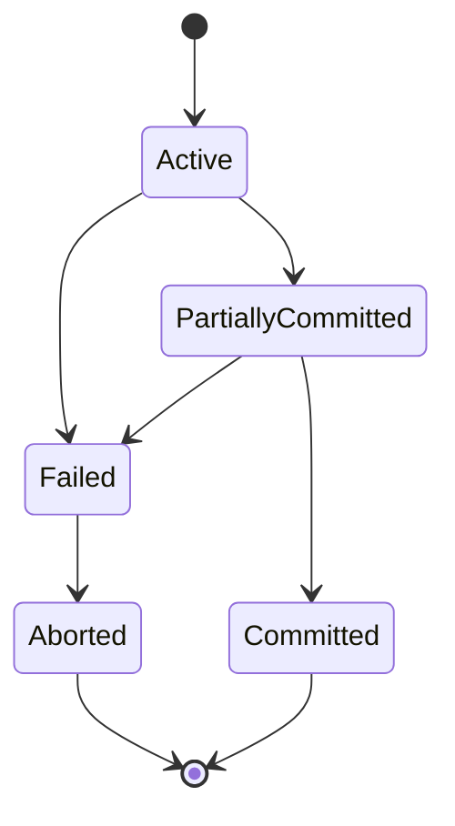

States:

- **Active**: Transaction is executing.
- **Partially committed**: Final statement executed, commit processing not complete.
- **Committed**: Changes are permanent.
- **Failed**: Error or crash prevents normal execution.
- **Aborted**: Effects have been rolled back.

Read/write notation:

- `r1(X)`: Transaction 1 reads item X.
- `w1(X)`: Transaction 1 writes item X.
- `c1`: Transaction 1 commits.
- `a1`: Transaction 1 aborts.

### 9.2 Schedules and Serializability

A **schedule** is an order of operations from multiple transactions.

**Serial schedule**: Transactions execute one after another without interleaving.

```text
r1(X) w1(X) c1 r2(X) w2(X) c2
```

**Concurrent schedule**: Operations are interleaved.

```text
r1(X) r2(X) w1(X) w2(X) c1 c2
```

**Serializable schedule**: Concurrent schedule equivalent to some serial schedule.

**Conflict operations**:

Two operations conflict if:

- They belong to different transactions.
- They access the same data item.
- At least one is a write.

Conflicts:

- Read-write: `r1(X)` and `w2(X)`
- Write-read: `w1(X)` and `r2(X)`
- Write-write: `w1(X)` and `w2(X)`

Not a conflict:

- Read-read: `r1(X)` and `r2(X)`

**Conflict serializability**:

A schedule is conflict-serializable if it can be transformed into a serial schedule by swapping non-conflicting operations.

**Precedence graph**:

1. Create one node per transaction.
2. For each conflict where operation of `Ti` occurs before conflicting operation of `Tj`, add edge `Ti -> Tj`.
3. If graph has no cycle, schedule is conflict-serializable.
4. Topological order gives equivalent serial order.

Example:

```text
S: r1(X) w1(X) r2(X) w2(X)
```

Conflicts:

- `w1(X)` before `r2(X)`: edge `T1 -> T2`
- `w1(X)` before `w2(X)`: edge `T1 -> T2`

No cycle, so equivalent to `T1` then `T2`.

**View serializability**:

A schedule is view-serializable if it is view-equivalent to a serial schedule. It is more general than conflict serializability but harder to test.

View equivalence preserves:

- Which transaction reads initial values.
- Which transaction's write is read by each read.
- Which transaction performs the final write on each data item.

Every conflict-serializable schedule is view-serializable, but not every view-serializable schedule is conflict-serializable.

### 9.3 Recoverability Classes

**Recoverable schedule**: If `Tj` reads data written by `Ti`, then `Tj` commits only after `Ti` commits.

Bad non-recoverable:

```text
w1(X) r2(X) c2 a1
```

`T2` commits after reading dirty data from `T1`, but `T1` aborts.

**Cascadeless schedule**: Transactions read only committed data. Avoids cascading aborts.

**Strict schedule**: If a transaction writes `X`, no other transaction can read or write `X` until the first transaction commits or aborts.

Strict schedules are easiest to recover and are widely used.

| Schedule type | Prevents dirty reads | Prevents cascading abort | Easy recovery |
|---|---:|---:|---:|
| Recoverable | Not always | No | Medium |
| Cascadeless | Yes | Yes | Good |
| Strict | Yes | Yes | Best |

### 9.4 Concurrency Problems

**Dirty read**: Transaction reads uncommitted data from another transaction.

```text
T1: UPDATE account SET balance = 0 WHERE id = 1;
T2: SELECT balance FROM account WHERE id = 1; -- reads 0
T1: ROLLBACK;
```

**Non-repeatable read**: Same row read twice gives different values because another transaction committed an update.

**Phantom read**: Re-running a predicate query returns different set of rows because another transaction inserted/deleted matching rows.

**Lost update**: Two transactions update same data, and one update overwrites the other.

Example:

```text
T1 reads balance 100
T2 reads balance 100
T1 writes 110
T2 writes 120
Final balance 120, T1 update lost
```

Correct approach:

```sql
BEGIN;

UPDATE accounts
SET balance = balance + 10
WHERE account_id = 1;

COMMIT;
```

Let the DBMS perform atomic update rather than read-modify-write in application memory.

### 9.5 Locking and Two-Phase Locking

**Lock** controls access to data items.

Types:

- **Shared lock (S)**: Required for reading.
- **Exclusive lock (X)**: Required for writing.
- **Binary lock**: Simple locked/unlocked scheme.

Lock compatibility matrix:

| Requested vs held | Shared held | Exclusive held |
|---|---:|---:|
| Shared requested | Compatible | Not compatible |
| Exclusive requested | Not compatible | Not compatible |

**Two-phase locking (2PL)**:

- Growing phase: transaction may acquire locks but not release any.
- Shrinking phase: transaction may release locks but not acquire any new locks.

2PL guarantees conflict serializability.

**Strict 2PL**:

- Holds all exclusive locks until commit or abort.
- Prevents cascading aborts.

**Rigorous 2PL**:

- Holds all shared and exclusive locks until commit or abort.
- Stronger than strict 2PL.

**Conservative 2PL**:

- Transaction obtains all needed locks before it starts.
- Prevents deadlocks but reduces concurrency.

Practical locking example:

```sql
BEGIN;

SELECT *
FROM accounts
WHERE account_id = 1
FOR UPDATE;

UPDATE accounts
SET balance = balance - 100
WHERE account_id = 1;

COMMIT;
```

`FOR UPDATE` locks selected rows for update.

### 9.6 Deadlocks and Timestamp-Based Protocols

**Deadlock** occurs when transactions wait for each other forever.

Example:

```text
T1 locks A, waits for B
T2 locks B, waits for A
```

Deadlock prevention:

- Lock ordering: always lock resources in same order.
- Wait-die: older transaction waits; younger aborts.
- Wound-wait: older aborts younger; younger waits.
- Conservative 2PL: acquire all locks before starting.

Deadlock detection:

- Build wait-for graph.
- Nodes are transactions.
- Edge `Ti -> Tj` means `Ti` waits for `Tj`.
- Cycle means deadlock.

Deadlock recovery:

- Abort one victim transaction.
- Roll it back.
- Release locks.
- Retry if appropriate.

**Timestamp ordering**:

- Each transaction gets a timestamp.
- Operations must respect timestamp order.
- If an operation violates ordering rules, transaction may abort and restart.

For each item `X`, DBMS tracks:

- `read_timestamp(X)`
- `write_timestamp(X)`

**Thomas write rule**:

If a transaction tries to write an old value that no future transaction would read, the obsolete write can be ignored instead of aborting the transaction. It increases concurrency for certain schedules.

### 9.7 Optimistic, MVCC, Snapshot Isolation, and SQL Isolation Levels

**Optimistic concurrency control** assumes conflicts are rare.

Phases:

1. Read phase: transaction reads and computes without locking writes.
2. Validation phase: DBMS checks for conflicts.
3. Write phase: if validation succeeds, changes are applied.

Good for read-heavy systems with low conflict rates.

**Multiversion concurrency control (MVCC)** keeps multiple versions of rows so readers and writers can proceed concurrently. PostgreSQL uses MVCC.

Benefits:

- Readers do not usually block writers.
- Writers do not usually block readers.
- Transactions see consistent snapshots.

Costs:

- Old row versions must be cleaned.
- Vacuum or garbage collection is needed.
- Long transactions can retain old versions.

**Snapshot isolation** lets a transaction read from a consistent snapshot. Write conflicts may be detected at commit. It prevents many anomalies but can allow write skew unless serializable isolation is used.

SQL isolation levels:

| Isolation level | Dirty read | Non-repeatable read | Phantom read | Notes |
|---|---:|---:|---:|---|
| Read Uncommitted | Possible by standard | Possible | Possible | PostgreSQL treats it as Read Committed |
| Read Committed | Prevented | Possible | Possible | Default in PostgreSQL |
| Repeatable Read | Prevented | Prevented | Usually prevented in PostgreSQL snapshot model | Same rows read consistently |
| Serializable | Prevented | Prevented | Prevented | Strongest; equivalent to serial execution |

Set isolation:

```sql
BEGIN TRANSACTION ISOLATION LEVEL SERIALIZABLE;

-- work

COMMIT;
```

Practical advice:

- Use default isolation for ordinary OLTP unless requirements demand more.
- Use row locks or atomic updates for counters and balances.
- Use serializable isolation for complex invariants across multiple rows.
- Keep transactions short to reduce lock and version pressure.

## 10. Database Recovery

Recovery restores the database to a correct state after failure.

### 10.1 Need for Recovery and Failure Types

Failures happen because of:

- Power loss
- Operating system crash
- DBMS crash
- Application error
- Transaction abort
- Disk failure
- Data corruption
- Human mistake
- Network partition
- Disaster affecting a data center

Failure types:

| Failure type | Description | Example |
|---|---|---|
| Transaction failure | One transaction cannot continue | Constraint violation, deadlock victim |
| System crash | Volatile memory lost, disk survives | Server crash |
| Disk failure | Persistent storage damaged | SSD failure |
| Media/site failure | Entire machine or site unavailable | Fire, flood, data-center outage |

Recovery must preserve atomicity and durability.

### 10.2 Log-Based Recovery and Write-Ahead Logging

Most DBMSs use a transaction log.

Log records may include:

- Transaction start
- Row/page before image
- Row/page after image
- Commit
- Abort
- Checkpoint

**Write-ahead logging (WAL)** rule:

The log record describing a change must be written to stable storage before the changed data page is written.

This allows recovery:

- If transaction committed but data page was not written, redo it.
- If transaction did not commit but data page was written, undo it.

**Undo** reverses effects of uncommitted transactions.

**Redo** reapplies effects of committed transactions.

**Undo-redo logging** supports both actions and is common.

Example:

```text
<T1 start>
<T1, account 1, old balance 1000, new balance 900>
<T1 commit>
```

If crash happens after commit but before page write, recovery redoes the update.

If crash happens before commit but after page write, recovery undoes the update.

### 10.3 Checkpoints, Shadow Paging, and ARIES

**Checkpoint** is a point where DBMS records enough information to reduce recovery work.

Checkpoint may flush dirty pages and write active transaction information to log.

Benefits:

- Recovery starts from recent checkpoint instead of beginning of log.
- Faster crash recovery.

**Shadow paging**:

- Keep old page version as shadow.
- Write changes to new page.
- Commit by switching page table pointer.

Advantages:

- Simple atomicity idea.
- No undo logging needed in basic form.

Disadvantages:

- Fragmentation.
- Harder with concurrency.
- Less common than WAL in large systems.

**ARIES overview**:

ARIES is a recovery algorithm family used as a foundation in many DBMS designs.

Phases:

1. **Analysis**: Determine dirty pages and active transactions at crash.
2. **Redo**: Repeat history from appropriate log point.
3. **Undo**: Roll back loser transactions that had not committed.

Important ARIES ideas:

- WAL
- Log sequence numbers (LSNs)
- Compensation log records for undo actions
- Steal/no-force buffer policy support

### 10.4 Backup, Restore, PITR, and Disaster Recovery

**Backup** is a copy of data used for recovery.

Types:

- Full backup
- Incremental backup
- Differential backup
- Logical backup, such as SQL dump
- Physical backup, such as data directory/base backup

PostgreSQL logical backup:

```bash
pg_dump -Fc -d ecommerce_db -f ecommerce_db.dump
```

Restore:

```bash
createdb ecommerce_restore
pg_restore -d ecommerce_restore ecommerce_db.dump
```

**Point-in-time recovery (PITR)** restores a database to a specific time using base backup plus WAL archives.

Use cases:

- Recover before accidental `DROP TABLE`.
- Recover before bad deployment.
- Recover before data corruption became visible.

**Disaster recovery** planning defines:

- RPO: Recovery Point Objective, maximum acceptable data loss.
- RTO: Recovery Time Objective, maximum acceptable downtime.
- Backup frequency.
- Off-site storage.
- Replication.
- Restore testing.
- Runbooks and responsibilities.

A backup strategy is incomplete until restore has been tested.

## 11. Storage and File Organization

### 11.1 Physical Storage and Memory Hierarchy

DBMS storage spans multiple layers:

| Layer | Speed | Volatility | Typical use |
|---|---:|---:|---|
| CPU cache | Fastest | Volatile | Processor operations |
| RAM | Fast | Volatile | Buffer pool, sorting, hashing |
| SSD | Medium-fast | Persistent | Data files, logs |
| HDD | Slower | Persistent | Bulk storage, archives |
| Remote/object storage | Variable | Persistent | Backups, data lakes |

DBMSs try to reduce slow I/O by caching data pages in memory.

### 11.2 Disk Blocks, Pages, Records, and Slotted Pages

**Disk block** is the unit transferred by storage hardware.

**Page** is the DBMS unit of storage and I/O. PostgreSQL commonly uses 8 KB pages.

**Record** or row is stored inside pages.

**Fixed-length records**:

- Same size for every record.
- Easy to locate by offset.
- May waste space.

**Variable-length records**:

- Records can have different sizes.
- Better for strings and nullable columns.
- Need offset metadata.

**Slotted page**:

Common layout for variable records:

```text
+-----------------------------+
| Page header                 |
| Slot directory              |
| slot 1 -> record offset     |
| slot 2 -> record offset     |
| Free space                  |
| Record data grows backward  |
+-----------------------------+
```

Benefits:

- Records can move within page while slot identifier remains stable.
- Variable-length records are manageable.
- Free space can be tracked.

### 11.3 File Organization

**Heap file organization**:

- Records stored wherever space is available.
- Fast inserts.
- Searching requires scan unless indexes exist.

**Sequential file organization**:

- Records stored in sorted order by key.
- Efficient range scans.
- Inserts/deletes may be expensive due to reorganization.

**Hash file organization**:

- Hash function maps key to bucket.
- Efficient equality search.
- Poor for range queries.

**Clustered file organization**:

- Related records are stored close together.
- Speeds up joins or range access patterns.

Example: Store orders physically near their customer or cluster table by order date.

### 11.4 Buffer Manager and Replacement Policies

The **buffer manager** controls the buffer pool, an area of memory containing cached database pages.

Responsibilities:

- Fetch page from disk into memory.
- Track dirty pages.
- Pin pages currently in use.
- Flush dirty pages to disk.
- Choose victim pages to evict.

Replacement policies:

| Policy | Idea |
|---|---|
| LRU | Evict least recently used page |
| MRU | Evict most recently used page, useful in some scans |
| Clock | Approximation of LRU with reference bits |
| LFU | Evict least frequently used page |

DBMS policies are more sophisticated than OS paging because the DBMS understands query access patterns, dirty pages, and transaction logging.

### 11.5 RAID and Tablespaces

**RAID** combines disks for performance and/or reliability.

| RAID level | Idea | Strength | Weakness |
|---|---|---|---|
| RAID 0 | Striping | Performance | No redundancy |
| RAID 1 | Mirroring | Redundancy, read speed | Storage cost |
| RAID 5 | Striping with parity | Efficient redundancy | Write penalty, rebuild risk |
| RAID 10 | Mirror plus stripe | Performance and redundancy | Higher cost |

**Tablespace** is a storage location where database objects can be placed.

Use cases:

- Put indexes on faster storage.
- Separate large tables.
- Manage storage quotas or I/O patterns.

PostgreSQL example:

```sql
CREATE TABLESPACE fast_space
LOCATION '/var/lib/postgresql/fast_space';

CREATE TABLE big_events (
    event_id BIGINT GENERATED ALWAYS AS IDENTITY PRIMARY KEY,
    event_time TIMESTAMPTZ NOT NULL,
    payload JSONB NOT NULL
) TABLESPACE fast_space;
```

## 12. Indexing and Hashing

### 12.1 Need for Indexes

An index is an auxiliary data structure that speeds up data retrieval.

Without index:

```sql
SELECT *
FROM customers
WHERE email = 'asha@example.com';
```

DBMS may scan every row.

With index:

```sql
CREATE UNIQUE INDEX idx_customers_email
ON customers (email);
```

DBMS can find matching row quickly.

Indexes help:

- Equality filters
- Range filters
- Joins
- Sorting
- Grouping
- Unique enforcement

Indexes hurt:

- Inserts
- Updates to indexed columns
- Deletes
- Storage usage
- Maintenance complexity

### 12.2 Index Types and Properties

**Primary index**: Index on primary key or ordering key of a sorted file.

**Secondary index**: Index on non-ordering attribute.

**Clustering index**: Data records are physically ordered or grouped according to index key.

**Dense index**: Contains index entry for every search key value or every record.

**Sparse index**: Contains entries for some search key values, usually one per block. Requires ordered data.

| Type | Entries | Requires sorted data | Storage | Lookup |
|---|---:|---:|---:|---|
| Dense | Many | No | Higher | Direct |
| Sparse | Fewer | Usually yes | Lower | Find block then scan |

**Single-level index**: One index layer points directly to data blocks. Can become large.

**Multi-level index**: Index on index blocks. B-trees and B+ trees are common multi-level indexes.

### 12.3 B-Tree and B+ Tree

**B-tree**:

- Balanced search tree.
- Keys sorted.
- Internal nodes guide search.
- Data pointers may appear in internal and leaf nodes.

**B+ tree**:

- Balanced tree.
- Internal nodes store separator keys.
- All data pointers are in leaf nodes.
- Leaves are linked for efficient range scans.

Most DBMS "B-tree" indexes are actually B+ tree-like.

Search cost is usually `O(log n)` with a high branching factor, so the number of page reads is small.

Range query example:

```sql
CREATE INDEX idx_orders_order_date
ON orders (order_date);

SELECT *
FROM orders
WHERE order_date >= DATE '2026-01-01'
  AND order_date < DATE '2026-02-01';
```

B+ tree works well because matching leaf entries are adjacent.

### 12.4 Hashing

**Hash index** maps search key through a hash function to a bucket.

Good for:

- Equality search: `WHERE id = 10`

Poor for:

- Range search: `WHERE id BETWEEN 10 AND 20`
- Sorting

**Static hashing**:

- Fixed number of buckets.
- Overflow chains occur as data grows.

**Dynamic hashing** adjusts buckets as data grows.

**Extendible hashing**:

- Uses directory of bucket pointers.
- Directory can double.
- Buckets split when full.

**Linear hashing**:

- Gradually splits buckets.
- Avoids full directory doubling.

### 12.5 Specialized and Practical Indexes

**Bitmap index**:

- Uses bitmaps for values.
- Efficient for low-cardinality columns in analytical workloads.
- Example: gender, status, region.

**Composite index**:

```sql
CREATE INDEX idx_orders_customer_date
ON orders (customer_id, order_date);
```

Useful for:

```sql
WHERE customer_id = 1
ORDER BY order_date DESC
```

Leftmost prefix rule: index on `(customer_id, order_date)` can help queries filtering by `customer_id`, or by `customer_id` and `order_date`, but usually not by `order_date` alone.

**Covering index**:

An index that contains all columns needed by a query, allowing index-only scan.

```sql
CREATE INDEX idx_orders_customer_status_total
ON orders (customer_id, status)
INCLUDE (order_total);
```

PostgreSQL supports `INCLUDE` columns.

**Unique index**:

```sql
CREATE UNIQUE INDEX idx_users_email
ON users (email);
```

**Partial index**:

```sql
CREATE INDEX idx_orders_pending
ON orders (created_at)
WHERE status = 'pending';
```

Useful when queries often filter a subset.

**Function-based index**:

```sql
CREATE INDEX idx_users_lower_email
ON users (lower(email));

SELECT *
FROM users
WHERE lower(email) = lower('Asha@Example.com');
```

**Clustered vs non-clustered index**:

- Clustered index determines or approximates physical order of table data.
- Non-clustered index is separate and points to table rows.
- PostgreSQL indexes are separate structures; `CLUSTER` can physically reorder a table once, but PostgreSQL does not maintain a continuously clustered table automatically.

**Index selectivity**:

Selectivity measures how many rows match a value. High selectivity means few rows match. Indexes are most useful when selectivity is high.

Good:

```sql
WHERE email = 'unique@example.com'
```

Poor:

```sql
WHERE is_active = true
```

if most rows are active.

Index design examples:

| Query pattern | Possible index |
|---|---|
| Find user by email | `UNIQUE (lower(email))` |
| Orders by customer and recent date | `(customer_id, order_date DESC)` |
| Pending jobs by priority | partial index on `(priority, created_at)` where status pending |
| Product search by category and price | `(category_id, price)` |
| Time-series events by time | `(event_time)` or partitioning plus local indexes |

## 13. Query Processing and Optimization

### 13.1 Query Processing Pipeline

When a SQL query is submitted, DBMS typically performs:

1. **Parsing**: Check SQL syntax and create parse tree.
2. **Validation**: Check tables, columns, types, privileges.
3. **Query translation**: Convert SQL to internal relational algebra-like form.
4. **Rewrite**: Expand views, simplify predicates, push filters.
5. **Logical query plan**: Decide logical operations.
6. **Physical query plan**: Choose algorithms and access methods.
7. **Execution**: Run plan and return rows.

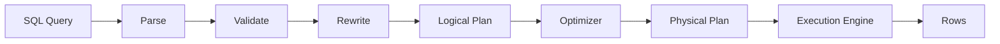

### 13.2 Cost-Based, Rule-Based, and Heuristic Optimization

**Cost-based optimization** estimates cost of alternative plans and chooses lowest estimated cost.

Cost factors:

- Disk I/O
- CPU
- Memory
- Network transfer
- Row counts
- Sort cost
- Join algorithm cost

**Rule-based optimization** uses fixed rules, such as use index if available. Older systems used more rule-based logic. Modern systems rely heavily on cost-based optimization.

**Heuristic optimization** uses generally good transformations:

- Push selections down before joins.
- Project unneeded columns early.
- Replace Cartesian product plus filter with join.
- Reorder joins.
- Use indexes for selective predicates.

### 13.3 Statistics, Cardinality, and Selectivity

**Statistics** describe table data distribution:

- Row count
- Page count
- Number of distinct values
- Null fraction
- Most common values
- Histograms
- Correlation

**Cardinality estimation** predicts how many rows an operation will produce.

**Selectivity** is fraction of rows matching a predicate.

Example:

```sql
SELECT *
FROM orders
WHERE status = 'cancelled';
```

If 2 percent of orders are cancelled, selectivity is 0.02.

Bad estimates can cause bad plans. Updating statistics helps:

```sql
ANALYZE orders;
```

### 13.4 Join Algorithms

**Nested loop join**:

For each row in outer table, scan inner table.

Good when:

- Outer relation is small.
- Inner relation has an index.
- Query has selective filter.

**Index nested loop join**:

For each outer row, use index on inner join key.

Example:

```sql
SELECT *
FROM customers AS c
JOIN orders AS o
  ON o.customer_id = c.customer_id
WHERE c.customer_id = 10;
```

Index on `orders(customer_id)` helps.

**Sort-merge join**:

Sort both inputs by join key, then merge.

Good when:

- Inputs are already sorted.
- Join produces many rows.
- Equality join.

**Hash join**:

Build hash table on smaller input, probe with larger input.

Good when:

- Equality join.
- Sufficient memory.
- Large unsorted inputs.

### 13.5 Pipelining, Materialization, EXPLAIN, and Tuning

**Pipelining** passes rows from one operator to next without storing full intermediate result.

**Materialization** stores intermediate results before next step.

Pipelining saves memory and time when possible. Materialization is useful when an intermediate result is reused or must be sorted/hashed.

PostgreSQL explain:

```sql
EXPLAIN
SELECT c.customer_id, count(o.order_id)
FROM customers AS c
LEFT JOIN orders AS o
  ON o.customer_id = c.customer_id
GROUP BY c.customer_id;
```

Actual execution:

```sql
EXPLAIN ANALYZE
SELECT c.customer_id, count(o.order_id)
FROM customers AS c
LEFT JOIN orders AS o
  ON o.customer_id = c.customer_id
GROUP BY c.customer_id;
```

`EXPLAIN ANALYZE` runs the query. Use care on expensive writes.

Query tuning example:

Slow query:

```sql
SELECT *
FROM orders
WHERE lower(customer_email) = lower('asha@example.com');
```

Problem: function on column may prevent ordinary index use.

Fix:

```sql
CREATE INDEX idx_orders_lower_customer_email
ON orders (lower(customer_email));
```

Another tuning example:

```sql
SELECT *
FROM orders
WHERE order_date >= DATE '2026-01-01'
  AND order_date < DATE '2026-02-01'
ORDER BY order_date;
```

Index:

```sql
CREATE INDEX idx_orders_order_date
ON orders (order_date);
```

Tuning checklist:

- Check actual plan with `EXPLAIN ANALYZE`.
- Compare estimated vs actual rows.
- Add or adjust indexes.
- Avoid functions on indexed columns unless function index exists.
- Select only needed columns.
- Rewrite correlated subqueries if they execute too often.
- Keep statistics fresh.
- Partition very large tables when access pattern supports it.

## 14. Distributed Databases

### 14.1 Distributed DBMS Concepts

A **distributed DBMS** manages data stored across multiple networked sites while providing a unified database experience.

Reasons for distribution:

- Geographic locality
- Scalability
- Fault tolerance
- Lower latency
- Regulatory data placement
- Organizational autonomy

**Homogeneous distributed database**:

- Same DBMS at all sites.
- Easier integration.

**Heterogeneous distributed database**:

- Different DBMSs, schemas, or data models.
- Requires translation and integration layers.

### 14.2 Fragmentation, Replication, and Allocation

**Fragmentation** splits a relation into pieces.

**Horizontal fragmentation** splits rows.

Example:

```text
Orders_US = orders where country = 'US'
Orders_IN = orders where country = 'IN'
```

**Vertical fragmentation** splits columns.

Example:

```text
CustomerPublic(customer_id, name, city)
CustomerPrivate(customer_id, email, phone, tax_id)
```

Must include key in fragments so original relation can be reconstructed.

**Mixed fragmentation** combines horizontal and vertical fragmentation.

**Replication** stores copies of data at multiple sites.

Benefits:

- High availability
- Lower read latency
- Fault tolerance

Costs:

- Consistency complexity
- Write coordination
- Conflict resolution
- More storage

**Allocation** decides where fragments and replicas are placed.

### 14.3 Distributed Query Processing and Transactions

Distributed query processing must consider:

- Local processing cost
- Network transfer cost
- Join location
- Data shipping vs query shipping
- Parallel execution

Example:

If customers are in India site and orders are in US site, a join may ship filtered rows rather than entire tables.

**Distributed transaction** spans multiple sites.

**Two-phase commit (2PC)**:

Phase 1: Prepare/vote

- Coordinator asks participants if they can commit.
- Participants write prepare log and vote yes/no.

Phase 2: Commit/abort

- If all vote yes, coordinator sends commit.
- If any vote no, coordinator sends abort.

Problem: 2PC can block if coordinator fails after participants prepare.

**Three-phase commit (3PC)** adds another phase to reduce blocking under assumptions, but it is more complex and less common in practical systems than 2PC or consensus-based approaches.

### 14.4 CAP, PACELC, Consistency, Quorum, Sharding

**CAP theorem**:

In the presence of a network partition, a distributed system must choose between:

- Consistency: every read sees latest write or error.
- Availability: every request receives non-error response.

Partition tolerance is necessary in real distributed systems, so the tradeoff during partition is commonly CP vs AP.

**PACELC theorem** extends CAP:

- If Partition occurs, choose Availability or Consistency.
- Else, choose Latency or Consistency.

**Consistency models**:

| Model | Meaning |
|---|---|
| Strong consistency | Reads see latest committed write |
| Eventual consistency | Replicas converge if no new writes occur |
| Causal consistency | Causally related operations are observed in order |
| Read-your-writes | A user sees their own writes |
| Monotonic reads | Once a user sees a value, they do not later see older value |

**Quorum**:

With `N` replicas:

- Write quorum `W`
- Read quorum `R`
- If `R + W > N`, read and write quorums overlap.

Example:

```text
N = 3, W = 2, R = 2
R + W = 4 > 3
```

This increases chance of reading latest write, depending on conflict and failure model.

**Sharding**:

Splits data across nodes by shard key.

Example:

```text
shard = hash(customer_id) mod number_of_shards
```

Good shard key:

- High cardinality.
- Even distribution.
- Frequently present in queries.
- Avoids hot spots.

**Partitioning** inside a DBMS is often local table division by range/list/hash. **Sharding** is distribution across database nodes.

### 14.5 Replication Strategies

**Leader-follower replication**:

- Writes go to leader.
- Followers replicate changes.
- Reads can go to followers if stale reads acceptable.

Pros:

- Simple writes.
- Good read scaling.

Cons:

- Leader bottleneck.
- Failover complexity.
- Replication lag.

**Multi-leader replication**:

- Multiple nodes accept writes.
- Conflicts must be resolved.

Good for:

- Multi-region writes.
- Offline/edge systems.

Hard part:

- Conflict detection and resolution.

**Leaderless replication**:

- Clients write/read from multiple replicas using quorums.
- System reconciles conflicts using versions, vector clocks, timestamps, or application rules.

Good for:

- High availability.
- Partition tolerance.

Tradeoff:

- Application may need to handle conflicts.

## 15. NoSQL and Modern Databases

### 15.1 Need for NoSQL

NoSQL systems emerged to handle requirements that traditional relational systems did not always address easily:

- Massive horizontal scale
- Flexible schemas
- High write throughput
- Low-latency key access
- Semi-structured data
- Graph traversal
- Distributed availability
- Specialized workloads such as search or time-series

NoSQL does not mean SQL is obsolete. It means "not only SQL." Many systems now combine relational and non-relational features.

### 15.2 SQL vs NoSQL

| Aspect | SQL databases | NoSQL databases |
|---|---|---|
| Data model | Relational tables | Key-value, document, column-family, graph, etc. |
| Schema | Usually predefined | Often flexible |
| Query language | SQL | Varies by system |
| Transactions | Strong ACID common | Varies; often aggregate-level or tunable |
| Joins | Strong support | Often limited or avoided |
| Scaling | Vertical plus read replicas/partitioning/sharding | Often horizontal by design |
| Consistency | Strong by default in many systems | Often tunable/eventual |
| Best for | Structured data, integrity, complex queries | Flexible, distributed, specialized workloads |

### 15.3 Types of NoSQL and Modern Databases

**Key-value databases**:

- Key maps to value.
- Example uses: cache, session store, feature flags.

Data modeling:

```text
cart:user:42 -> {"items":[{"sku":"P1","qty":2}]}
```

**Document databases**:

- Store JSON-like documents.
- Related data often embedded.

Good:

```json
{
  "product_id": "P100",
  "name": "Mechanical Keyboard",
  "attributes": {
    "switch": "brown",
    "layout": "TKL"
  },
  "tags": ["keyboard", "office", "gaming"]
}
```

**Column-family databases**:

- Wide rows, sparse columns.
- Model around query patterns.

Example:

```text
partition key: customer_id
clustering key: order_time
columns: order_id, status, total
```

**Graph databases**:

- Nodes and edges.
- Excellent for relationship traversal.

Example:

```text
(Asha)-[:FRIEND_OF]->(Neel)
(Neel)-[:BOUGHT]->(Product P100)
```

**Time-series databases**:

- Optimized for timestamped measurements.
- Uses compression, retention policies, downsampling.

Examples:

- Metrics
- IoT readings
- Logs
- Financial ticks

**Search databases**:

- Optimized for text search, ranking, inverted indexes.
- Useful for product search, log search, document search.

**NewSQL**:

- Attempts to combine SQL and ACID transactions with distributed scalability.
- Often uses consensus and distributed query processing.

**Polyglot persistence**:

- Use different databases for different needs.

Example architecture:

- PostgreSQL for orders and payments.
- Redis for cache and sessions.
- Elasticsearch/OpenSearch for search.
- ClickHouse/warehouse for analytics.
- Neo4j or graph engine for recommendations.

### 15.4 BASE, Schema-less Design, Aggregates, and Modeling

**BASE properties**:

| BASE | Meaning |
|---|---|
| Basically Available | System tries to remain available |
| Soft state | State may change due to replication/convergence |
| Eventual consistency | Replicas converge eventually |

**Schema-less** does not mean no schema. It means the database may not enforce a rigid schema. The application still needs data shape, validation, versioning, and migration strategy.

**Aggregate**:

An aggregate is a cluster of related data treated as a unit.

Example: An order document with its line items.

NoSQL modeling principles:

- Start from query patterns.
- Embed data read together.
- Reference data that changes independently or grows without bound.
- Avoid unbounded arrays in one document.
- Duplicate data deliberately when it improves reads, but plan update strategy.
- Design partition keys to distribute load.

When to use SQL:

- Strong consistency and ACID transactions are central.
- Complex ad hoc queries and joins matter.
- Data is structured and relationships are important.
- Integrity constraints must be enforced centrally.
- Reporting and analytics use relational logic.

When to use NoSQL:

- Workload needs massive horizontal scaling with simple access patterns.
- Schema changes rapidly.
- Data is naturally document, graph, key-value, time-series, or search-oriented.
- Availability/latency tradeoffs are acceptable and understood.

## 16. Data Warehousing and Analytics

### 16.1 OLTP and OLAP

**OLTP (Online Transaction Processing)** systems handle day-to-day transactions.

Examples:

- Place order
- Transfer money
- Update inventory
- Book ticket

Characteristics:

- Many small reads/writes.
- Current detailed data.
- Strong consistency.
- Normalized schemas common.
- Low latency.

**OLAP (Online Analytical Processing)** systems support analysis and reporting.

Examples:

- Monthly sales by region.
- Customer retention analysis.
- Product profitability.
- Trend analysis.

Characteristics:

- Large scans and aggregations.
- Historical data.
- Denormalized dimensional schemas common.
- Columnar storage common.
- Optimized for read-heavy analytics.

### 16.2 Warehouse, Data Mart, ETL, ELT

**Data warehouse** is a central analytical store integrated from multiple sources.

**Data mart** is a smaller analytical store focused on one department or subject area, such as sales or finance.

**ETL**:

- Extract from sources.
- Transform data before loading.
- Load into warehouse.

**ELT**:

- Extract.
- Load raw data into warehouse/lake.
- Transform inside analytical platform.

Modern cloud warehouses often favor ELT because compute is scalable.

### 16.3 Star Schema, Snowflake Schema, Facts, and Dimensions

**Fact table** stores measurable events.

Example: `fact_sales`.

Measures:

- Quantity
- Sales amount
- Discount
- Profit

Foreign keys:

- Date key
- Product key
- Customer key
- Store key

**Dimension table** stores descriptive context.

Examples:

- `dim_date`
- `dim_product`
- `dim_customer`
- `dim_store`

**Star schema**:

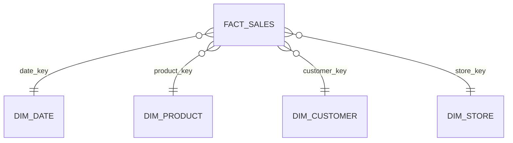

Fact table at center, dimensions around it.

**Snowflake schema** normalizes dimensions into sub-dimensions.

Example:

`dim_product` links to `dim_category` and `dim_brand`.

Star is simpler and often faster. Snowflake reduces redundancy but may require more joins.

### 16.4 Slowly Changing Dimensions, Cubes, and Operations

**Slowly changing dimensions (SCD)** track changes in dimension attributes.

| Type | Behavior | Example |
|---|---|---|
| Type 1 | Overwrite old value | Correct spelling mistake |
| Type 2 | Add new row with effective dates | Customer changes city; preserve history |
| Type 3 | Add previous value column | Track current and previous region |

Type 2 example:

| customer_key | customer_id | city | valid_from | valid_to | current_flag |
|---:|---:|---|---|---|---|
| 1 | 100 | Delhi | 2025-01-01 | 2026-03-01 | false |
| 2 | 100 | Mumbai | 2026-03-01 | null | true |

**Data cube** represents measures across multiple dimensions.

Operations:

- **Roll-up**: Aggregate to higher level, such as day to month.
- **Drill-down**: Move to more detail, such as year to quarter to month.
- **Slice**: Select one dimension value, such as region = North.
- **Dice**: Select a sub-cube using multiple filters.

**Columnar storage** stores data by columns instead of rows. It is effective for analytics because queries often scan a few columns across many rows.

**Data lake** stores raw structured, semi-structured, and unstructured data.

**Lakehouse** combines data lake flexibility with warehouse-like management features such as transactions, schema enforcement, and governance.

## 17. Database Security

### 17.1 Authentication, Authorization, Roles, and Privileges

**Authentication** verifies identity.

Examples:

- Password
- Certificate
- Kerberos
- IAM token
- Multi-factor system outside DB

**Authorization** decides what authenticated users can do.

**Role** is a named set of privileges. Users can be assigned roles.

Create roles:

```sql
CREATE ROLE app_user LOGIN PASSWORD 'replace_with_strong_secret';
CREATE ROLE reporting_user LOGIN PASSWORD 'replace_with_strong_secret';
CREATE ROLE app_readwrite;
CREATE ROLE app_readonly;
```

Grant role:

```sql
GRANT app_readwrite TO app_user;
GRANT app_readonly TO reporting_user;
```

Privileges:

```sql
GRANT SELECT, INSERT, UPDATE, DELETE ON orders TO app_readwrite;
GRANT SELECT ON orders TO app_readonly;
REVOKE DELETE ON orders FROM app_readwrite;
```

Use least privilege: grant only what is necessary.

### 17.2 Views, Row-Level Security, and SQL Injection

Views for security:

```sql
CREATE VIEW public_customer_view AS
SELECT customer_id, full_name, city
FROM customers;

GRANT SELECT ON public_customer_view TO support_user;
```

The user can query the view without seeing sensitive columns such as password hashes or tax IDs.

Row-level security in PostgreSQL:

```sql
ALTER TABLE orders ENABLE ROW LEVEL SECURITY;

CREATE POLICY customer_order_policy
ON orders
FOR SELECT
USING (customer_id = current_setting('app.current_customer_id')::BIGINT);
```

SQL injection prevention:

- Use prepared statements.
- Use parameterized queries.
- Validate and whitelist identifiers if dynamic SQL is required.
- Avoid concatenating raw input.
- Use least-privilege DB accounts.
- Log suspicious query failures.

### 17.3 Encryption, Passwords, Auditing, Backups, Compliance

**Encryption at rest** protects stored data files or backups.

Methods:

- Disk encryption
- Tablespace/storage encryption
- Column-level encryption for highly sensitive data

**Encryption in transit** protects network traffic.

Use TLS/SSL connections between clients, applications, and database servers.

**Hashing passwords**:

- Never store plaintext passwords.
- Use strong adaptive password hashing such as bcrypt, scrypt, or Argon2 in the application layer.
- Use salt.
- Do not use fast hashes such as plain SHA-256 for passwords.

**Auditing** records important actions:

- Login attempts
- Privilege changes
- Schema changes
- Access to sensitive data
- Failed queries
- Administrative actions

Backups and security:

- Encrypt backups.
- Restrict backup access.
- Test restores in secure environments.
- Apply retention rules.
- Protect WAL archives.

Compliance basics:

- Know applicable rules such as GDPR, HIPAA, PCI DSS, SOC 2, or local laws.
- Classify sensitive data.
- Minimize collected data.
- Enforce retention and deletion policies.
- Keep access logs.
- Review privileges regularly.

## 18. Database Administration

### 18.1 DBA Responsibilities

DBA work includes:

- Installation and upgrades.
- Configuration tuning.
- User and role management.
- Backup and recovery.
- Monitoring and alerting.
- Replication management.
- High availability.
- Security hardening.
- Performance troubleshooting.
- Schema change coordination.
- Capacity planning.
- Disaster recovery planning.

### 18.2 User Management, Backup Strategy, and Restore Testing

User management:

```sql
CREATE ROLE analyst LOGIN PASSWORD 'replace_with_strong_secret';
GRANT CONNECT ON DATABASE ecommerce_db TO analyst;
GRANT USAGE ON SCHEMA public TO analyst;
GRANT SELECT ON ALL TABLES IN SCHEMA public TO analyst;
```

Backup strategy should define:

- What is backed up.
- How often backups run.
- Where backups are stored.
- How long backups are retained.
- How backups are encrypted.
- Who can restore.
- How restore is tested.
- RPO and RTO.

Restore testing:

1. Restore backup into isolated environment.
2. Run integrity checks.
3. Validate row counts and critical queries.
4. Test application compatibility.
5. Measure restore time.
6. Document findings.

### 18.3 Monitoring, Logging, Vacuum, Analyze, and Replication

Monitor:

- CPU, memory, disk I/O, network
- Connections
- Locks and deadlocks
- Long-running queries
- Slow queries
- Replication lag
- Cache hit ratio
- Table and index bloat
- Disk usage growth
- Error logs

Logging:

- Log slow queries.
- Log failed authentication.
- Log schema changes.
- Keep logs searchable and retained appropriately.

PostgreSQL vacuum/analyze:

- `VACUUM` cleans dead row versions created by MVCC.
- `ANALYZE` updates statistics used by optimizer.
- Autovacuum performs this automatically, but large workloads may need tuning.

```sql
VACUUM ANALYZE orders;
```

Replication management:

- Monitor lag.
- Test failover.
- Ensure replicas have enough capacity.
- Protect replication credentials.
- Understand synchronous vs asynchronous replication.

### 18.4 Migrations, Schema Versioning, Capacity, HA, DR

Migration management:

- Use migration tools.
- Version every schema change.
- Review generated SQL.
- Test on staging.
- Back up before risky migrations.
- Make large migrations online when possible.

Schema versioning:

- Store migration history.
- Ensure deployments and schema changes are coordinated.
- Use backward-compatible changes for zero-downtime deployment.

Capacity planning:

- Estimate data growth.
- Track index size.
- Plan storage headroom.
- Forecast connection and query load.
- Plan archival and partitioning.

High availability:

- Replication
- Automatic failover
- Health checks
- Load balancers
- Backups
- Runbooks

Disaster recovery planning:

- Define RPO/RTO.
- Store backups off-site.
- Test full-site recovery.
- Document who does what during incident.

## 19. Performance Tuning and Best Practices

### 19.1 Schema Design Best Practices

- Model real entities and relationships clearly.
- Normalize to remove anomalies, then denormalize only when justified.
- Use appropriate data types.
- Use `NUMERIC` for money.
- Use `TIMESTAMPTZ` for real event times.
- Use foreign keys for integrity.
- Use `CHECK` constraints for valid status/ranges.
- Avoid storing derived values unless needed for performance.
- Avoid unbounded text blobs in hot OLTP tables if they are rarely read.
- Partition very large tables by access pattern.

### 19.2 Query Design Best Practices

- Select only needed columns.
- Use predicates that can use indexes.
- Avoid leading wildcard search such as `LIKE '%term'` for large tables unless using specialized indexes.
- Avoid row-by-row queries when set-based query works.
- Avoid N+1 queries.
- Use pagination carefully.
- Prefer keyset pagination for large offsets.
- Keep transactions short.
- Use `EXPLAIN ANALYZE` for slow queries.

N+1 example:

Bad:

```text
Query 1: SELECT * FROM customers LIMIT 100;
Then 100 queries: SELECT * FROM orders WHERE customer_id = ?
```

Better:

```sql
SELECT c.customer_id, c.full_name, o.order_id, o.order_date
FROM customers AS c
LEFT JOIN orders AS o
  ON o.customer_id = c.customer_id
WHERE c.customer_id = ANY($1);
```

### 19.3 Indexing, Pooling, Caching, Replicas, and Partitioning

Indexing best practices:

- Index primary keys and foreign keys used in joins.
- Create composite indexes matching common query predicates.
- Remove unused indexes.
- Use partial indexes for common subsets.
- Use covering indexes for hot read queries.
- Do not index every column blindly.

Connection pooling:

- Opening a database connection is expensive.
- Pooling reuses connections.
- Prevents database overload from too many app connections.

Caching:

- Cache expensive read results.
- Invalidate cache correctly.
- Use TTL when exact freshness is not required.
- Avoid cache stampede with locks or request coalescing.

Read replicas:

- Use replicas for read-heavy workloads.
- Be aware of replication lag.
- Do not read from replica immediately after write if read-your-writes is required.

Partitioning:

- Range partition by date for time-series/order data.
- List partition by region/status when access pattern matches.
- Hash partition for even distribution.

### 19.4 Materialized Views, Lock Contention, Slow Query Analysis

Materialized views:

- Precompute expensive aggregations.
- Refresh on schedule or after data load.
- Useful for dashboards and reports.

Lock contention:

- Keep transactions short.
- Access rows in consistent order.
- Avoid user interaction inside transactions.
- Use appropriate isolation.
- Monitor blocked queries.

Slow query analysis:

1. Capture slow query.
2. Run `EXPLAIN ANALYZE`.
3. Compare estimated and actual row counts.
4. Check indexes and predicates.
5. Check join order and join algorithm.
6. Check sort/hash memory spills.
7. Update statistics.
8. Rewrite query if needed.
9. Test with realistic data.

Common performance mistakes:

- Missing index on foreign key.
- `SELECT *` on wide tables.
- Large `OFFSET`.
- Applying functions to indexed columns without function index.
- Too many indexes on write-heavy tables.
- Long transactions.
- Chatty application doing N+1 queries.
- Stale statistics.
- Ignoring replication lag.
- Using database as a queue without proper locking pattern.

## 20. Complete Sample Database Project

This project designs an E-Commerce Database System using PostgreSQL-compatible SQL.

### 20.1 Requirements

Functional requirements:

- Customers can register with unique email.
- Customers can have multiple addresses.
- Products belong to categories.
- Products have inventory quantity.
- Customers can create orders.
- Orders contain one or more order items.
- Each order has a status.
- Payments are recorded for orders.
- Shipments are recorded for orders.
- Customers can review purchased products.
- Administrators can manage products and inventory.

Non-functional requirements:

- Enforce data integrity with constraints.
- Support transactional order placement.
- Support reporting queries.
- Support index-based search by customer, order date, status, and product category.
- Restrict application and reporting privileges.
- Allow backup and restore.

### 20.2 Entities and Relationships

Entities:

- Customer
- Address
- Category
- Product
- Inventory
- Order
- OrderItem
- Payment
- Shipment
- Review

Relationships:

- Customer has many addresses.
- Category has many products.
- Product has one inventory row.
- Customer places many orders.
- Order contains many order items.
- Product appears in many order items.
- Order has payments.
- Order has shipments.
- Customer reviews product.

### 20.3 ER Diagram Using Mermaid

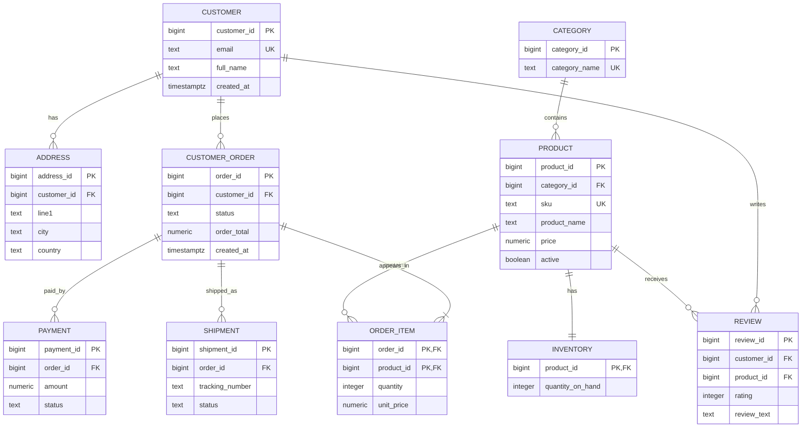

### 20.4 Relational Schema

```text
Customer(customer_id PK, email UNIQUE, full_name, phone, created_at)
Address(address_id PK, customer_id FK, line1, line2, city, state, postal_code, country, is_default)
Category(category_id PK, category_name UNIQUE, parent_category_id FK nullable)
Product(product_id PK, category_id FK, sku UNIQUE, product_name, description, price, active, created_at)
Inventory(product_id PK/FK, quantity_on_hand, reorder_level, updated_at)
CustomerOrder(order_id PK, customer_id FK, shipping_address_id FK, status, order_total, created_at)
OrderItem(order_id PK/FK, product_id PK/FK, quantity, unit_price, line_total)
Payment(payment_id PK, order_id FK, amount, method, status, paid_at)
Shipment(shipment_id PK, order_id FK, tracking_number UNIQUE, carrier, status, shipped_at, delivered_at)
Review(review_id PK, customer_id FK, product_id FK, rating, review_text, created_at, UNIQUE(customer_id, product_id))
```

Normalization:

- Customer data is separate from orders, avoiding repeated customer details.
- Product data is separate from order items, preserving product identity.
- `unit_price` is stored in `order_items` because order history should preserve price at purchase time.
- `line_total` and `order_total` are denormalized derived values for performance and historical clarity; they must be maintained transactionally.
- Addresses are separate because customers may have multiple addresses.
- Inventory is separate from product because it changes frequently and has operational meaning.

### 20.5 PostgreSQL CREATE TABLE Scripts

```sql
CREATE TABLE customers (
    customer_id BIGINT GENERATED ALWAYS AS IDENTITY PRIMARY KEY,
    email TEXT NOT NULL UNIQUE,
    full_name TEXT NOT NULL,
    phone TEXT,
    created_at TIMESTAMPTZ NOT NULL DEFAULT now(),
    CHECK (email = lower(email))
);

CREATE TABLE addresses (
    address_id BIGINT GENERATED ALWAYS AS IDENTITY PRIMARY KEY,
    customer_id BIGINT NOT NULL REFERENCES customers(customer_id) ON DELETE CASCADE,
    line1 TEXT NOT NULL,
    line2 TEXT,
    city TEXT NOT NULL,
    state TEXT,
    postal_code TEXT NOT NULL,
    country TEXT NOT NULL,
    is_default BOOLEAN NOT NULL DEFAULT false
);

CREATE TABLE categories (
    category_id BIGINT GENERATED ALWAYS AS IDENTITY PRIMARY KEY,
    parent_category_id BIGINT REFERENCES categories(category_id),
    category_name TEXT NOT NULL UNIQUE
);

CREATE TABLE products (
    product_id BIGINT GENERATED ALWAYS AS IDENTITY PRIMARY KEY,
    category_id BIGINT NOT NULL REFERENCES categories(category_id),
    sku TEXT NOT NULL UNIQUE,
    product_name TEXT NOT NULL,
    description TEXT,
    price NUMERIC(12, 2) NOT NULL CHECK (price >= 0),
    active BOOLEAN NOT NULL DEFAULT true,
    created_at TIMESTAMPTZ NOT NULL DEFAULT now()
);

CREATE TABLE inventory (
    product_id BIGINT PRIMARY KEY REFERENCES products(product_id) ON DELETE CASCADE,
    quantity_on_hand INTEGER NOT NULL CHECK (quantity_on_hand >= 0),
    reorder_level INTEGER NOT NULL DEFAULT 0 CHECK (reorder_level >= 0),
    updated_at TIMESTAMPTZ NOT NULL DEFAULT now()
);

CREATE TABLE customer_orders (
    order_id BIGINT GENERATED ALWAYS AS IDENTITY PRIMARY KEY,
    customer_id BIGINT NOT NULL REFERENCES customers(customer_id),
    shipping_address_id BIGINT NOT NULL REFERENCES addresses(address_id),
    status TEXT NOT NULL DEFAULT 'pending'
        CHECK (status IN ('pending', 'paid', 'packed', 'shipped', 'delivered', 'cancelled')),
    order_total NUMERIC(12, 2) NOT NULL DEFAULT 0 CHECK (order_total >= 0),
    created_at TIMESTAMPTZ NOT NULL DEFAULT now()
);

CREATE TABLE order_items (
    order_id BIGINT NOT NULL REFERENCES customer_orders(order_id) ON DELETE CASCADE,
    product_id BIGINT NOT NULL REFERENCES products(product_id),
    quantity INTEGER NOT NULL CHECK (quantity > 0),
    unit_price NUMERIC(12, 2) NOT NULL CHECK (unit_price >= 0),
    line_total NUMERIC(12, 2) GENERATED ALWAYS AS (quantity * unit_price) STORED,
    PRIMARY KEY (order_id, product_id)
);

CREATE TABLE payments (
    payment_id BIGINT GENERATED ALWAYS AS IDENTITY PRIMARY KEY,
    order_id BIGINT NOT NULL REFERENCES customer_orders(order_id) ON DELETE CASCADE,
    amount NUMERIC(12, 2) NOT NULL CHECK (amount > 0),
    method TEXT NOT NULL CHECK (method IN ('card', 'upi', 'wallet', 'bank_transfer', 'cod')),
    status TEXT NOT NULL CHECK (status IN ('initiated', 'success', 'failed', 'refunded')),
    paid_at TIMESTAMPTZ
);

CREATE TABLE shipments (
    shipment_id BIGINT GENERATED ALWAYS AS IDENTITY PRIMARY KEY,
    order_id BIGINT NOT NULL REFERENCES customer_orders(order_id) ON DELETE CASCADE,
    tracking_number TEXT UNIQUE,
    carrier TEXT,
    status TEXT NOT NULL DEFAULT 'not_shipped'
        CHECK (status IN ('not_shipped', 'shipped', 'in_transit', 'delivered', 'returned')),
    shipped_at TIMESTAMPTZ,
    delivered_at TIMESTAMPTZ
);

CREATE TABLE reviews (
    review_id BIGINT GENERATED ALWAYS AS IDENTITY PRIMARY KEY,
    customer_id BIGINT NOT NULL REFERENCES customers(customer_id) ON DELETE CASCADE,
    product_id BIGINT NOT NULL REFERENCES products(product_id) ON DELETE CASCADE,
    rating INTEGER NOT NULL CHECK (rating BETWEEN 1 AND 5),
    review_text TEXT,
    created_at TIMESTAMPTZ NOT NULL DEFAULT now(),
    UNIQUE (customer_id, product_id)
);
```

### 20.6 Sample INSERT Data

```sql
INSERT INTO customers (email, full_name, phone)
VALUES
    ('asha@example.com', 'Asha Rao', '9000000001'),
    ('neel@example.com', 'Neel Shah', '9000000002'),
    ('mira@example.com', 'Mira Sen', '9000000003');

INSERT INTO addresses (customer_id, line1, city, state, postal_code, country, is_default)
VALUES
    (1, '12 MG Road', 'Bengaluru', 'KA', '560001', 'India', true),
    (2, '22 Park Street', 'Kolkata', 'WB', '700016', 'India', true),
    (3, '7 Marine Drive', 'Mumbai', 'MH', '400020', 'India', true);

INSERT INTO categories (category_name)
VALUES ('Electronics'), ('Books'), ('Home');

INSERT INTO products (category_id, sku, product_name, description, price)
VALUES
    (1, 'KB-100', 'Mechanical Keyboard', 'Tenkeyless keyboard', 4500.00),
    (1, 'MS-200', 'Wireless Mouse', 'Ergonomic mouse', 1200.00),
    (2, 'BK-DBMS', 'Database Systems Book', 'DBMS concepts and SQL', 900.00),
    (3, 'HM-LAMP', 'Desk Lamp', 'LED desk lamp', 1500.00);

INSERT INTO inventory (product_id, quantity_on_hand, reorder_level)
VALUES
    (1, 50, 10),
    (2, 100, 20),
    (3, 30, 5),
    (4, 25, 5);

INSERT INTO customer_orders (customer_id, shipping_address_id, status, order_total)
VALUES
    (1, 1, 'paid', 5700.00),
    (2, 2, 'pending', 900.00),
    (3, 3, 'shipped', 1500.00);

INSERT INTO order_items (order_id, product_id, quantity, unit_price)
VALUES
    (1, 1, 1, 4500.00),
    (1, 2, 1, 1200.00),
    (2, 3, 1, 900.00),
    (3, 4, 1, 1500.00);

INSERT INTO payments (order_id, amount, method, status, paid_at)
VALUES
    (1, 5700.00, 'upi', 'success', now()),
    (2, 900.00, 'card', 'initiated', null),
    (3, 1500.00, 'card', 'success', now());

INSERT INTO shipments (order_id, tracking_number, carrier, status, shipped_at)
VALUES
    (3, 'TRK123456', 'BlueDart', 'shipped', now());

INSERT INTO reviews (customer_id, product_id, rating, review_text)
VALUES
    (1, 1, 5, 'Excellent keyboard'),
    (3, 4, 4, 'Good lamp for study table');
```

### 20.7 Beginner Queries

List all products:

```sql
SELECT product_id, sku, product_name, price
FROM products
WHERE active = true
ORDER BY product_name;
```

Find one customer:

```sql
SELECT *
FROM customers
WHERE email = 'asha@example.com';
```

Show products below a price:

```sql
SELECT product_name, price
FROM products
WHERE price < 2000
ORDER BY price;
```

### 20.8 Intermediate Queries

Orders with customer names:

```sql
SELECT
    o.order_id,
    c.full_name,
    o.status,
    o.order_total,
    o.created_at
FROM customer_orders AS o
JOIN customers AS c
  ON c.customer_id = o.customer_id
ORDER BY o.created_at DESC;
```

Product sales quantity:

```sql
SELECT
    p.product_name,
    sum(oi.quantity) AS units_sold,
    sum(oi.line_total) AS revenue
FROM order_items AS oi
JOIN products AS p
  ON p.product_id = oi.product_id
GROUP BY p.product_name
ORDER BY revenue DESC;
```

Customers with no orders:

```sql
SELECT c.customer_id, c.full_name
FROM customers AS c
LEFT JOIN customer_orders AS o
  ON o.customer_id = c.customer_id
WHERE o.order_id IS NULL;
```

### 20.9 Advanced Queries: Joins, Aggregations, Windows, CTEs

Top product per category by revenue:

```sql
WITH product_revenue AS (
    SELECT
        p.category_id,
        p.product_id,
        p.product_name,
        sum(oi.line_total) AS revenue
    FROM products AS p
    JOIN order_items AS oi
      ON oi.product_id = p.product_id
    GROUP BY p.category_id, p.product_id, p.product_name
),
ranked AS (
    SELECT
        pr.*,
        dense_rank() OVER (
            PARTITION BY category_id
            ORDER BY revenue DESC
        ) AS revenue_rank
    FROM product_revenue AS pr
)
SELECT category_id, product_id, product_name, revenue
FROM ranked
WHERE revenue_rank = 1;
```

Customer lifetime value:

```sql
SELECT
    c.customer_id,
    c.full_name,
    coalesce(sum(o.order_total), 0) AS lifetime_value
FROM customers AS c
LEFT JOIN customer_orders AS o
  ON o.customer_id = c.customer_id
 AND o.status <> 'cancelled'
GROUP BY c.customer_id, c.full_name
ORDER BY lifetime_value DESC;
```

Monthly revenue:

```sql
SELECT
    date_trunc('month', created_at) AS order_month,
    sum(order_total) AS revenue
FROM customer_orders
WHERE status IN ('paid', 'packed', 'shipped', 'delivered')
GROUP BY date_trunc('month', created_at)
ORDER BY order_month;
```

Recursive category tree:

```sql
WITH RECURSIVE category_tree AS (
    SELECT
        category_id,
        parent_category_id,
        category_name,
        1 AS depth,
        category_name AS path
    FROM categories
    WHERE parent_category_id IS NULL

    UNION ALL

    SELECT
        child.category_id,
        child.parent_category_id,
        child.category_name,
        parent.depth + 1,
        parent.path || ' > ' || child.category_name
    FROM categories AS child
    JOIN category_tree AS parent
      ON child.parent_category_id = parent.category_id
)
SELECT *
FROM category_tree
ORDER BY path;
```

### 20.10 Transaction: Place an Order

This transaction creates an order, inserts order items, decreases inventory, and records payment. It uses row locks to prevent overselling.

```sql
BEGIN;

-- Lock inventory rows for products being purchased.
SELECT product_id, quantity_on_hand
FROM inventory
WHERE product_id IN (1, 2)
FOR UPDATE;

-- Check availability in application or with guarded updates.
UPDATE inventory
SET quantity_on_hand = quantity_on_hand - 1,
    updated_at = now()
WHERE product_id = 1
  AND quantity_on_hand >= 1;

UPDATE inventory
SET quantity_on_hand = quantity_on_hand - 1,
    updated_at = now()
WHERE product_id = 2
  AND quantity_on_hand >= 1;

INSERT INTO customer_orders (customer_id, shipping_address_id, status, order_total)
VALUES (1, 1, 'paid', 5700.00)
RETURNING order_id;

-- Suppose returned order_id is 4.
INSERT INTO order_items (order_id, product_id, quantity, unit_price)
VALUES
    (4, 1, 1, 4500.00),
    (4, 2, 1, 1200.00);

INSERT INTO payments (order_id, amount, method, status, paid_at)
VALUES (4, 5700.00, 'upi', 'success', now());

COMMIT;
```

In an application, verify that each inventory update affected one row. If not, rollback and report insufficient stock.

### 20.11 Triggers and Views

Trigger to maintain `order_total`:

```sql
CREATE OR REPLACE FUNCTION recalculate_order_total()
RETURNS trigger
LANGUAGE plpgsql
AS $$
DECLARE
    target_order_id BIGINT;
BEGIN
    target_order_id := coalesce(NEW.order_id, OLD.order_id);

    UPDATE customer_orders
    SET order_total = coalesce((
        SELECT sum(line_total)
        FROM order_items
        WHERE order_id = target_order_id
    ), 0)
    WHERE order_id = target_order_id;

    RETURN coalesce(NEW, OLD);
END;
$$;

CREATE TRIGGER trg_recalculate_order_total
AFTER INSERT OR UPDATE OR DELETE ON order_items
FOR EACH ROW
EXECUTE FUNCTION recalculate_order_total();
```

View for order summary:

```sql
CREATE VIEW order_summary AS
SELECT
    o.order_id,
    c.full_name,
    c.email,
    o.status,
    o.order_total,
    count(oi.product_id) AS item_count,
    o.created_at
FROM customer_orders AS o
JOIN customers AS c
  ON c.customer_id = o.customer_id
LEFT JOIN order_items AS oi
  ON oi.order_id = o.order_id
GROUP BY o.order_id, c.full_name, c.email, o.status, o.order_total, o.created_at;
```

### 20.12 Indexing Strategy

```sql
CREATE INDEX idx_customers_lower_email
ON customers (lower(email));

CREATE INDEX idx_addresses_customer_id
ON addresses (customer_id);

CREATE INDEX idx_products_category_id
ON products (category_id);

CREATE INDEX idx_products_active_price
ON products (active, price);

CREATE INDEX idx_orders_customer_created
ON customer_orders (customer_id, created_at DESC);

CREATE INDEX idx_orders_status_created
ON customer_orders (status, created_at DESC);

CREATE INDEX idx_order_items_product_id
ON order_items (product_id);

CREATE INDEX idx_payments_order_id
ON payments (order_id);

CREATE INDEX idx_shipments_order_id
ON shipments (order_id);

CREATE INDEX idx_reviews_product_rating
ON reviews (product_id, rating);
```

Why:

- Email lookup is common during login.
- Customer order history filters by customer and recent date.
- Admin dashboards filter by order status.
- Product listing filters by category and price.
- Joins need indexes on foreign keys.

### 20.13 Query Optimization Examples

Before:

```sql
SELECT *
FROM customer_orders
WHERE status = 'pending'
ORDER BY created_at DESC;
```

Potential index:

```sql
CREATE INDEX idx_orders_pending_created
ON customer_orders (created_at DESC)
WHERE status = 'pending';
```

Check plan:

```sql
EXPLAIN ANALYZE
SELECT order_id, customer_id, order_total, created_at
FROM customer_orders
WHERE status = 'pending'
ORDER BY created_at DESC
LIMIT 50;
```

Avoid:

```sql
SELECT *
FROM products
WHERE product_name ILIKE '%keyboard%';
```

For large product search, consider PostgreSQL full-text search or trigram indexes.

### 20.14 Backup, Restore, and Security Roles

Backup:

```bash
pg_dump -Fc -d ecommerce_db -f ecommerce_db.dump
```

Restore:

```bash
createdb ecommerce_restore
pg_restore -d ecommerce_restore ecommerce_db.dump
```

Security roles:

```sql
CREATE ROLE ecommerce_app LOGIN PASSWORD 'replace_with_secure_secret';
CREATE ROLE ecommerce_reporter LOGIN PASSWORD 'replace_with_secure_secret';

GRANT CONNECT ON DATABASE ecommerce_db TO ecommerce_app, ecommerce_reporter;
GRANT USAGE ON SCHEMA public TO ecommerce_app, ecommerce_reporter;

GRANT SELECT, INSERT, UPDATE, DELETE ON
    customers,
    addresses,
    customer_orders,
    order_items,
    payments,
    shipments,
    reviews
TO ecommerce_app;

GRANT SELECT ON
    customers,
    products,
    categories,
    customer_orders,
    order_items,
    order_summary
TO ecommerce_reporter;
```

Principle: app role can write operational tables; reporter role can only read approved data.

## 21. Comparison Tables

### 21.1 File System vs DBMS

| Feature | File system | DBMS |
|---|---|---|
| Data organization | Files and folders | Schemas, tables, indexes, catalogs |
| Redundancy | High risk | Controlled by design |
| Concurrency | Manual | Built-in |
| Integrity | Application-coded | Constraints and transactions |
| Recovery | File backup | WAL, checkpoints, PITR |
| Querying | Custom code | SQL/query language |
| Security | File permissions | Roles, privileges, policies |

### 21.2 DBMS vs RDBMS

| Aspect | DBMS | RDBMS |
|---|---|---|
| Meaning | Any database management system | DBMS based on relational model |
| Data model | Many possible models | Tables/relations |
| Relationships | Varies | Keys and foreign keys |
| Query language | Varies | SQL usually |
| Examples | MongoDB, Neo4j, Redis, PostgreSQL | PostgreSQL, MySQL, Oracle |

### 21.3 SQL vs NoSQL

| Aspect | SQL | NoSQL |
|---|---|---|
| Schema | Fixed/evolving schema | Flexible schema |
| Integrity | Strong constraints | Often application-managed |
| Joins | Strong | Limited or model-specific |
| Scaling | Mature vertical, replicas, partitions | Often horizontal by design |
| Best for | Transactions, relational data | Flexible/distributed/specialized data |

### 21.4 OLTP vs OLAP

| Aspect | OLTP | OLAP |
|---|---|---|
| Purpose | Run operations | Analyze data |
| Queries | Short reads/writes | Large scans/aggregations |
| Data | Current detailed | Historical summarized/detailed |
| Schema | Normalized common | Star/snowflake common |
| Users | Applications, clerks | Analysts, executives |

### 21.5 1-Tier vs 2-Tier vs 3-Tier

| Architecture | Layers | Strength | Weakness |
|---|---|---|---|
| 1-tier | App and DB together | Simple | Poor scalability |
| 2-tier | Client and DB server | Direct, easy for small apps | DB exposed to clients |
| 3-tier | UI, app server, DB | Secure, scalable, maintainable | More infrastructure |

### 21.6 Hierarchical vs Network vs Relational

| Aspect | Hierarchical | Network | Relational |
|---|---|---|---|
| Structure | Tree | Records with links | Tables |
| Relationship | One parent per child | Multiple parents possible | Keys and joins |
| Query | Navigational | Navigational | Declarative |
| Flexibility | Low | Medium | High |
| Use | Strict hierarchy | Legacy complex records | General purpose |

### 21.7 Primary Key vs Foreign Key

| Aspect | Primary key | Foreign key |
|---|---|---|
| Purpose | Identifies row | References row in another table |
| Uniqueness | Must be unique | May repeat |
| Nulls | Not allowed | May be allowed unless `NOT NULL` |
| Count per table | One primary key | Many foreign keys possible |

### 21.8 Candidate Key vs Super Key

| Aspect | Candidate key | Super key |
|---|---|---|
| Uniqueness | Unique | Unique |
| Minimal | Yes | Not necessarily |
| Example | `{email}` | `{email, full_name}` |
| Role | Candidate for primary key | General uniqueness set |

### 21.9 1NF vs 2NF vs 3NF vs BCNF

| Normal form | Removes | Main rule |
|---|---|---|
| 1NF | Repeating groups | Atomic values |
| 2NF | Partial dependency | Non-prime attributes depend on whole key |
| 3NF | Transitive dependency | Non-key facts depend only on keys |
| BCNF | More FD anomalies | Every determinant is a super key |

### 21.10 BCNF vs 4NF vs 5NF

| Normal form | Concern | Dependency type |
|---|---|---|
| BCNF | Functional dependencies | `X -> Y` |
| 4NF | Independent multi-valued facts | `X ->-> Y` |
| 5NF | Complex join decompositions | Join dependencies |

### 21.11 Dense vs Sparse Index

| Aspect | Dense index | Sparse index |
|---|---|---|
| Entries | Every key/record | Some keys, often one per block |
| Storage | More | Less |
| Lookup | Faster direct | Needs block scan |
| Requirement | No strict sorting needed | Usually sorted data |

### 21.12 Clustered vs Non-Clustered Index

| Aspect | Clustered | Non-clustered |
|---|---|---|
| Data order | Data stored in index order | Separate index points to data |
| Count | Usually one | Many possible |
| Range scan | Very efficient | Efficient but may need row lookups |
| Write cost | Can be higher due to physical order | Maintains separate structure |

### 21.13 B-Tree vs B+ Tree

| Aspect | B-tree | B+ tree |
|---|---|---|
| Data pointers | Internal and leaf nodes possible | Leaf nodes only |
| Range scan | Less convenient | Very efficient with linked leaves |
| Fanout | Lower if data in internal nodes | Higher |
| DBMS use | Conceptual | Common practical index structure |

### 21.14 Hash Index vs B+ Tree Index

| Aspect | Hash index | B+ tree index |
|---|---|---|
| Equality search | Excellent | Good |
| Range search | Poor | Excellent |
| Ordering | Not useful | Useful |
| Prefix/order by | No | Yes |
| Best for | Exact lookup | General purpose |

### 21.15 Normalization vs Denormalization

| Aspect | Normalization | Denormalization |
|---|---|---|
| Goal | Reduce redundancy | Improve read performance/simplicity |
| Integrity | Easier | Harder |
| Joins | More | Fewer |
| Storage | Less duplicate data | More duplicate data |
| Use | OLTP design | Reporting, caches, hot paths |

### 21.16 Conflict Serializability vs View Serializability

| Aspect | Conflict serializability | View serializability |
|---|---|---|
| Based on | Conflicting operations | Read-from and final-write relationships |
| Testing | Easy with precedence graph | Harder |
| Strictness | More restrictive | More general |
| Practical use | Common in theory and protocols | Important conceptually |

### 21.17 Recoverable vs Cascadeless vs Strict Schedules

| Aspect | Recoverable | Cascadeless | Strict |
|---|---|---|---|
| Dirty reads | May occur | Not allowed | Not allowed |
| Dirty writes | May occur | May occur | Not allowed |
| Cascading aborts | Possible | Prevented | Prevented |
| Recovery | Acceptable | Better | Best |

### 21.18 Isolation Levels

| Level | Dirty read | Non-repeatable read | Phantom | Typical use |
|---|---:|---:|---:|---|
| Read Uncommitted | Possible | Possible | Possible | Rare |
| Read Committed | No | Possible | Possible | Default many systems |
| Repeatable Read | No | No | Possible by standard | Consistent row reads |
| Serializable | No | No | No | Strong correctness |

### 21.19 Horizontal vs Vertical Partitioning

| Aspect | Horizontal | Vertical |
|---|---|---|
| Splits by | Rows | Columns |
| Example | Orders by month | Customer public/private columns |
| Benefit | Prune partitions by row predicate | Avoid reading rarely used columns |
| Reconstruction | Union | Join by key |

### 21.20 Replication vs Sharding

| Aspect | Replication | Sharding |
|---|---|---|
| Meaning | Copy same data to nodes | Split data across nodes |
| Goal | Availability/read scaling | Write/data scaling |
| Data on each node | Same or subset replica | Different shard |
| Challenge | Consistency/lag | Cross-shard queries/rebalancing |

### 21.21 Star Schema vs Snowflake Schema

| Aspect | Star schema | Snowflake schema |
|---|---|---|
| Dimension design | Denormalized | Normalized |
| Joins | Fewer | More |
| Query simplicity | Higher | Lower |
| Redundancy | More | Less |
| Common use | BI dashboards | Controlled dimension hierarchy |

## 22. Practice and Interview Preparation

### 22.1 DBMS Theory Questions with Answers

**Q1. What is a DBMS?**

A DBMS is software that manages databases. It provides facilities for defining schemas, storing data, querying data, enforcing constraints, controlling concurrency, securing access, and recovering from failures.

**Q2. What is data independence?**

Data independence is the ability to change schema at one level without requiring changes at the next higher level. Physical data independence hides storage changes. Logical data independence hides logical schema changes from views/applications where possible.

**Q3. What is difference between schema and instance?**

Schema is the structure of a database. Instance is the actual data at a particular moment.

**Q4. Why are constraints important?**

Constraints enforce correctness centrally. They prevent invalid data even if application code has bugs or multiple applications access the same database.

**Q5. What is a weak entity?**

A weak entity lacks a complete key of its own and depends on an owner entity. Its key is usually owner key plus partial key.

### 22.2 SQL Questions with Answers

**Q1. Find second highest salary.**

```sql
SELECT max(salary) AS second_highest_salary
FROM employees
WHERE salary < (SELECT max(salary) FROM employees);
```

With ties using ranking:

```sql
SELECT salary
FROM (
    SELECT salary, dense_rank() OVER (ORDER BY salary DESC) AS rnk
    FROM employees
) AS ranked
WHERE rnk = 2;
```

**Q2. Find duplicate emails.**

```sql
SELECT email, count(*) AS count_rows
FROM users
GROUP BY email
HAVING count(*) > 1;
```

**Q3. Find customers with no orders.**

```sql
SELECT c.*
FROM customers AS c
WHERE NOT EXISTS (
    SELECT 1
    FROM customer_orders AS o
    WHERE o.customer_id = c.customer_id
);
```

**Q4. Delete duplicates keeping lowest ID.**

```sql
DELETE FROM users AS u
USING users AS older
WHERE u.email = older.email
  AND u.user_id > older.user_id;
```

**Q5. Get top 3 products per category.**

```sql
SELECT *
FROM (
    SELECT
        p.*,
        row_number() OVER (
            PARTITION BY category_id
            ORDER BY price DESC
        ) AS rn
    FROM products AS p
) AS ranked
WHERE rn <= 3;
```

### 22.3 Normalization Problems with Solutions

Problem:

```text
R(StudentId, StudentName, CourseId, CourseName, Instructor, Grade)
FDs:
StudentId -> StudentName
CourseId -> CourseName, Instructor
StudentId, CourseId -> Grade
```

Solution:

- Candidate key: `(StudentId, CourseId)`.
- Partial dependencies:
  - `StudentId -> StudentName`
  - `CourseId -> CourseName, Instructor`
- Decompose:

```text
Student(StudentId, StudentName)
Course(CourseId, CourseName, Instructor)
Enrollment(StudentId, CourseId, Grade)
```

Problem:

```text
R(A, B, C, D)
FDs: A -> B, B -> C, C -> D
```

Find key and 3NF decomposition.

Solution:

- `A+ = {A, B, C, D}`, so `A` is key.
- Transitive dependencies through `B` and `C`.
- 3NF decomposition:

```text
R1(A, B)
R2(B, C)
R3(C, D)
```

### 22.4 Relational Algebra Problems with Solutions

Problem: Find students enrolled in course 101.

```text
pi student_id (sigma course_id = 101 (Enrollment))
```

SQL:

```sql
SELECT student_id
FROM enrollment
WHERE course_id = 101;
```

Problem: Find names of students enrolled in DBMS.

```text
pi name (
    Student join Student.student_id = Enrollment.student_id
    (
        Enrollment join Enrollment.course_id = Course.course_id
        sigma title = 'DBMS' (Course)
    )
)
```

SQL:

```sql
SELECT s.name
FROM student AS s
JOIN enrollment AS e
  ON e.student_id = s.student_id
JOIN course AS c
  ON c.course_id = e.course_id
WHERE c.title = 'DBMS';
```

Problem: Find students enrolled in all courses.

```text
pi student_id, course_id (Enrollment) divide pi course_id (Course)
```

SQL:

```sql
SELECT s.student_id
FROM student AS s
WHERE NOT EXISTS (
    SELECT 1
    FROM course AS c
    WHERE NOT EXISTS (
        SELECT 1
        FROM enrollment AS e
        WHERE e.student_id = s.student_id
          AND e.course_id = c.course_id
    )
);
```

### 22.5 Transaction Schedule Problems with Solutions

Problem:

```text
S = r1(X) w1(X) r2(X) w2(X) r1(Y) w1(Y)
```

Is it conflict-serializable?

Solution:

- On `X`: `w1(X)` before `r2(X)` gives edge `T1 -> T2`.
- On `X`: `w1(X)` before `w2(X)` gives edge `T1 -> T2`.
- No operation by `T2` conflicts later with `T1` on same item.
- Graph has no cycle.
- Conflict-serializable as `T1` before `T2`.

Problem:

```text
S = r1(X) w1(X) r2(X) w2(X) r1(X)
```

Solution:

- `w1(X)` before `r2(X)` gives `T1 -> T2`.
- `w2(X)` before `r1(X)` gives `T2 -> T1`.
- Cycle exists.
- Not conflict-serializable.

Recoverability problem:

```text
w1(X) r2(X) c2 a1
```

Solution:

- `T2` reads uncommitted value written by `T1`.
- `T2` commits before `T1` aborts.
- Non-recoverable schedule.

### 22.6 Indexing and Query Optimization Questions

**Q1. Why might an index not be used?**

Possible reasons:

- Predicate is not selective.
- Table is small.
- Function is applied to column without function index.
- Data type mismatch.
- Statistics are stale.
- Query needs many rows, so sequential scan is cheaper.
- Composite index column order does not match query.

**Q2. What index helps this query?**

```sql
SELECT *
FROM orders
WHERE customer_id = 10
ORDER BY created_at DESC
LIMIT 20;
```

Answer:

```sql
CREATE INDEX idx_orders_customer_created
ON orders (customer_id, created_at DESC);
```

**Q3. Why is `OFFSET 100000` slow?**

The DBMS still has to locate and skip many rows. Keyset pagination uses last seen key and is usually faster.

```sql
SELECT *
FROM orders
WHERE created_at < $1
ORDER BY created_at DESC
LIMIT 20;
```

### 22.7 Scenario-Based Database Design Questions

Scenario: Design a URL shortener.

Core tables:

```text
Url(short_code PK, original_url, created_by, created_at, expires_at)
Click(click_id PK, short_code FK, clicked_at, ip_hash, user_agent)
```

Key choices:

- `short_code` should be unique.
- Index `created_by` for user dashboard.
- Click table may be partitioned by time.
- Store analytics aggregates for fast dashboards.

Scenario: Design a chat application.

Core tables:

```text
User(user_id PK, username UNIQUE)
Conversation(conversation_id PK, type)
ConversationMember(conversation_id FK, user_id FK, joined_at, last_read_at)
Message(message_id PK, conversation_id FK, sender_id FK, body, sent_at)
```

Indexes:

- `(conversation_id, sent_at DESC)` for message history.
- `(user_id)` on conversation members.

Scenario: Design a library system.

Core tables:

```text
Book(book_id PK, isbn UNIQUE, title)
BookCopy(copy_id PK, book_id FK, barcode UNIQUE, status)
Member(member_id PK, email UNIQUE)
Loan(loan_id PK, copy_id FK, member_id FK, borrowed_at, due_at, returned_at)
Fine(fine_id PK, loan_id FK, amount, status)
```

Business rules:

- Only available copies can be loaned.
- One active loan per copy.
- Fines generated for overdue loans.

### 22.8 Common Interview Traps

- Confusing candidate key with primary key.
- Saying foreign key must be unique. It usually is not.
- Forgetting that SQL `NULL` is not equal to `NULL`.
- Using `COUNT(column)` when `COUNT(*)` is intended; `COUNT(column)` ignores nulls.
- Assuming `WHERE` can use aliases from `SELECT`.
- Using `NOT IN` with nullable subquery results; `NOT EXISTS` is safer.
- Thinking normalization always improves performance.
- Thinking indexes always improve performance.
- Ignoring transaction isolation anomalies.
- Confusing DELETE, TRUNCATE, and DROP.
- Confusing view and materialized view.
- Assuming natural joins are safe in production code.

### 22.9 Quick Revision Notes

- DBMS manages data, metadata, security, concurrency, and recovery.
- RDBMS stores data in relations/tables.
- ER modeling designs entities, attributes, relationships, and constraints.
- Relational model uses keys, domains, tuples, relations, and integrity rules.
- SQL DDL defines structure; DML changes data; DQL queries data; DCL controls access; TCL controls transactions.
- Normalization reduces redundancy and anomalies.
- BCNF requires every determinant to be a super key.
- Transactions require ACID.
- Conflict serializability is tested with precedence graph.
- Strict schedules are easiest to recover.
- WAL enables undo/redo recovery.
- Indexes speed reads and slow writes.
- B+ trees are excellent for range queries.
- Hash indexes are excellent for equality queries.
- Optimizers rely on statistics and cardinality estimates.
- Distributed systems trade consistency, availability, and latency.
- Security requires least privilege, encryption, auditing, and injection prevention.

## 23. Final Revision Section

### 23.1 DBMS Roadmap from Beginner to Advanced

1. Learn data, databases, DBMS, RDBMS, schemas, and instances.
2. Understand DBMS architecture and data independence.
3. Study ER modeling and ER-to-relational mapping.
4. Master relational model, keys, and constraints.
5. Learn SQL thoroughly: DDL, DML, joins, grouping, subqueries, windows, CTEs.
6. Learn relational algebra and calculus for theory.
7. Master functional dependencies and normalization.
8. Study transactions, serializability, locks, deadlocks, and isolation.
9. Learn recovery: WAL, undo, redo, checkpoints, backups.
10. Understand storage, pages, file organization, and buffer management.
11. Study indexing, hashing, and query optimization.
12. Learn distributed databases, replication, sharding, CAP, and consistency.
13. Learn NoSQL models and when to use each.
14. Study warehousing, OLAP, star schemas, and analytics.
15. Learn security, DBA tasks, performance tuning, and real-world operations.

### 23.2 Must-Know Formulas and Rules

Candidate key:

```text
X is candidate key if X+ contains all attributes and no proper subset of X has that property.
```

Lossless binary decomposition:

```text
R decomposed into R1 and R2 is lossless if:
(R1 intersect R2) -> R1
or
(R1 intersect R2) -> R2
```

Conflict condition:

```text
Different transactions + same item + at least one write = conflict
```

Quorum overlap:

```text
R + W > N
```

Selectivity:

```text
selectivity = matching rows / total rows
```

B+ tree lookup:

```text
approximately O(log fanout N)
```

ACID:

```text
Atomicity, Consistency, Isolation, Durability
```

### 23.3 Must-Know SQL Patterns

Find missing child rows:

```sql
SELECT p.*
FROM parent AS p
WHERE NOT EXISTS (
    SELECT 1
    FROM child AS c
    WHERE c.parent_id = p.parent_id
);
```

Top N per group:

```sql
SELECT *
FROM (
    SELECT
        t.*,
        row_number() OVER (
            PARTITION BY group_id
            ORDER BY score DESC
        ) AS rn
    FROM items AS t
) AS ranked
WHERE rn <= 3;
```

Aggregate with filter:

```sql
SELECT
    customer_id,
    count(*) FILTER (WHERE status = 'paid') AS paid_orders,
    count(*) FILTER (WHERE status = 'cancelled') AS cancelled_orders
FROM customer_orders
GROUP BY customer_id;
```

Upsert:

```sql
INSERT INTO inventory (product_id, quantity_on_hand)
VALUES (1, 10)
ON CONFLICT (product_id)
DO UPDATE
SET quantity_on_hand = inventory.quantity_on_hand + EXCLUDED.quantity_on_hand,
    updated_at = now();
```

Recursive tree:

```sql
WITH RECURSIVE tree AS (
    SELECT id, parent_id, name, 1 AS depth
    FROM nodes
    WHERE parent_id IS NULL

    UNION ALL

    SELECT n.id, n.parent_id, n.name, t.depth + 1
    FROM nodes AS n
    JOIN tree AS t
      ON n.parent_id = t.id
)
SELECT *
FROM tree;
```

### 23.4 Must-Know Diagrams

ANSI/SPARC:

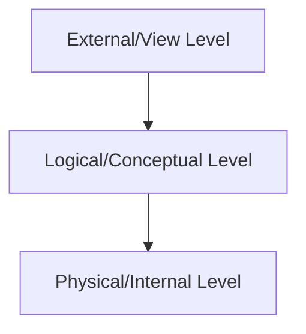

Transaction states:

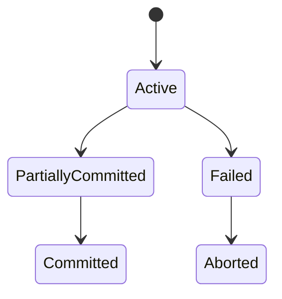

3-tier architecture:

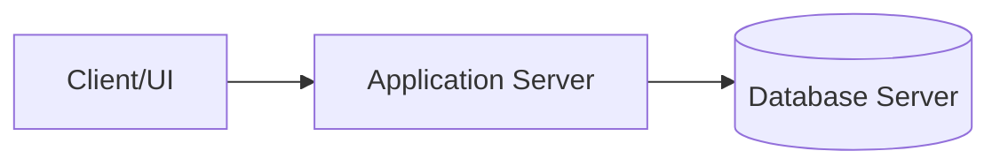

Star schema:

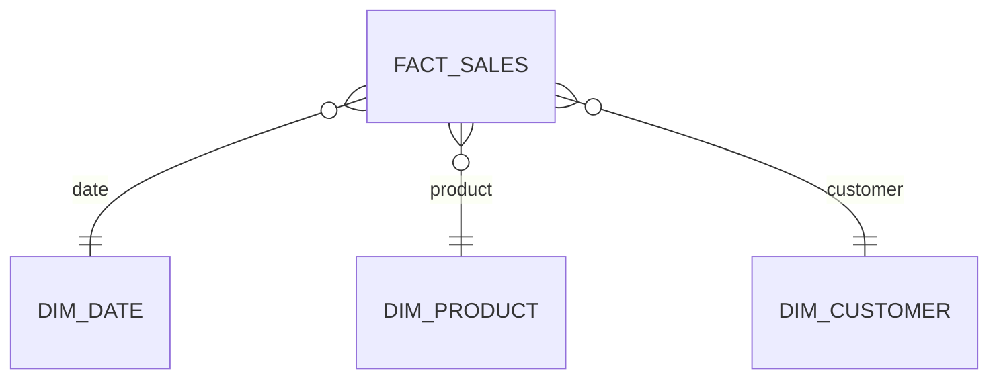

### 23.5 Last-Minute Exam Revision Checklist

- Can you define DBMS, RDBMS, schema, instance, metadata?
- Can you explain file system vs DBMS?
- Can you draw ANSI/SPARC architecture?
- Can you map ER diagrams to relational tables?
- Can you identify keys in a relation?
- Can you write SQL joins, group queries, subqueries, and CTEs?
- Can you compute attribute closure?
- Can you identify 1NF, 2NF, 3NF, BCNF violations?
- Can you perform lossless decomposition checks?
- Can you build a precedence graph?
- Can you distinguish conflict and view serializability?
- Can you explain ACID and isolation anomalies?
- Can you explain 2PL and deadlocks?
- Can you explain WAL, undo, redo, and checkpoints?
- Can you compare B+ tree and hash indexes?
- Can you read a simple query plan?
- Can you explain CAP and replication?
- Can you choose SQL vs NoSQL for a scenario?

### 23.6 Interview Checklist

- Be precise with definitions.
- Give examples with each concept.
- Mention tradeoffs, not only advantages.
- For schema design questions, start with requirements and access patterns.
- For SQL questions, clarify duplicates and null behavior.
- For transaction questions, identify anomalies and isolation needs.
- For performance questions, ask about data size, query pattern, indexes, and plan.
- For distributed questions, discuss consistency, availability, latency, and failure modes.
- For security questions, mention least privilege, parameterized queries, encryption, and auditing.

### 23.7 Glossary of DBMS Terms

| Term | Definition |
|---|---|
| ACID | Atomicity, Consistency, Isolation, Durability properties of transactions |
| Aggregation | ER concept treating a relationship as a higher-level entity |
| Attribute | Column/property of an entity or relation |
| Attribute closure | Set of attributes determined by a given attribute set |
| Backup | Copy of data for recovery |
| BCNF | Normal form where every determinant is a super key |
| B+ tree | Balanced index structure with linked leaf nodes |
| Candidate key | Minimal set of attributes uniquely identifying tuples |
| Cardinality | Number of tuples or relationship multiplicity depending on context |
| Catalog | Metadata repository of database objects |
| Checkpoint | Recovery marker that reduces log replay work |
| Concurrency control | Techniques for correct simultaneous transaction execution |
| Constraint | Rule enforced by DBMS |
| Data independence | Ability to change lower schema level without changing higher level |
| Database | Organized collection of related data |
| DBMS | Software that manages databases |
| DCL | SQL commands for access control |
| DDL | SQL commands for defining structure |
| Deadlock | Transactions wait on each other in a cycle |
| Denormalization | Intentional redundancy for performance or simplicity |
| DML | SQL commands for changing data |
| Domain | Set of allowed values for an attribute |
| DQL | SQL querying, mainly `SELECT` |
| Entity | Distinguishable real-world object or concept |
| Entity integrity | Primary keys must be unique and not null |
| ER model | Conceptual database design model using entities and relationships |
| Foreign key | Attribute referencing key in another table |
| Functional dependency | Relationship where one attribute set determines another |
| Hash index | Index based on hash function, good for equality search |
| Index | Data structure that speeds retrieval |
| Instance | Actual database content at a point in time |
| Isolation level | SQL setting controlling visibility among concurrent transactions |
| Join | Operation combining rows from relations |
| Key | Attribute set used to identify tuples |
| Lock | Mechanism controlling concurrent access |
| Lossless decomposition | Decomposition that reconstructs original relation without spurious tuples |
| Materialized view | Stored query result that can be refreshed |
| Metadata | Data describing data |
| MVCC | Multiversion concurrency control |
| Normalization | Structuring relations to reduce redundancy and anomalies |
| OLAP | Analytical processing workload |
| OLTP | Transaction processing workload |
| Primary key | Chosen candidate key for tuple identification |
| Query optimizer | DBMS component choosing efficient execution plan |
| RAID | Disk arrangement for performance/redundancy |
| RDBMS | Relational database management system |
| Recovery | Restoring database correctness after failure |
| Referential integrity | Foreign keys must reference valid rows or be null if allowed |
| Relation | Table-like structure in relational model |
| Relational algebra | Procedural formal query language for relations |
| Relational calculus | Declarative formal query language for relations |
| Replication | Maintaining copies of data on multiple nodes |
| Schedule | Interleaving of transaction operations |
| Schema | Database structure definition |
| Serializable | Equivalent to some serial transaction order |
| Sharding | Splitting data across database nodes |
| SQL injection | Attack where input changes query meaning |
| Super key | Attribute set that uniquely identifies tuples |
| TCL | SQL transaction control commands |
| Transaction | Logical unit of database work |
| Tuple | Row in a relation |
| View | Virtual table defined by a query |
| WAL | Write-ahead logging for recovery |

End of guide.
